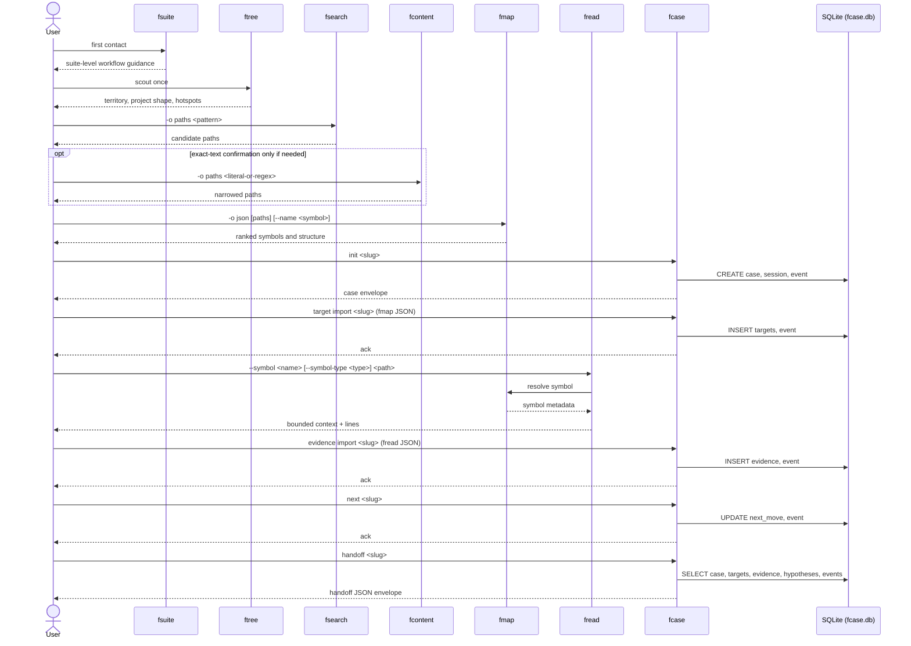
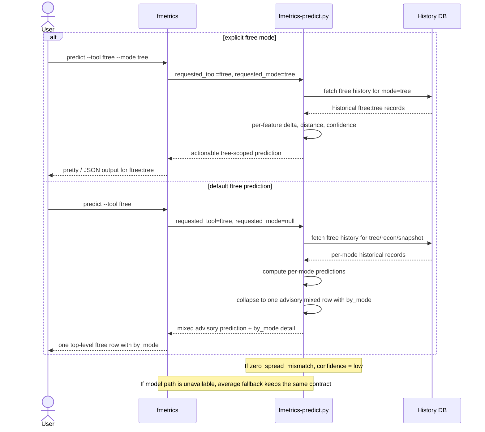

# fsuite

<p align="center">
  
</p>

<p align="center">
  <em>Deploy the drones. Map the terrain. Return with intel.</em>
</p>

[](https://github.com/lliWcWill/fsuite/releases)


---

**A suite-level guide plus twelve operational tools for filesystem reconnaissance, continuity, patching, replay, binary analysis, and analytics.**

`fsuite` provides one suite-level guide command plus twelve operational tools that turn filesystem exploration into a clean, scriptable, agent-friendly investigation workflow:

| Tool | Purpose |
|------|---------|
| **`fsuite`** | Print the suite-level conceptual flow, tool roles, and headless usage guidance |
| **`fs`** | Unified search entry point — classifies query intent and auto-routes to `fsearch`, `fcontent`, or `fmap` |
| **`ftree`** | Visualize directory structure with smart defaults and recon mode |
| **`fsearch`** | Find files by name, extension, or glob pattern |
| **`fcontent`** | Search _inside_ files for text (powered by ripgrep) |
| **`fmap`** | Extract structural skeleton from code (code cartography) |
| **`fread`** | Read files with budgets, ranges, context windows, and diff-aware input |
| **`fcase`** | Preserve investigation state, evidence, and handoffs once the seam is known |
| **`fedit`** | Apply surgical text patches with dry-run diffs, preconditions, and symbol scoping |
| **`fwrite`** | Write or overwrite files from agent output — MCP-native, safe atomic writes (MCP adapter only) |
| **`freplay`** | Deterministic replay of recorded investigation command sequences |
| **`fprobe`** | Binary and opaque-file reconnaissance — strings, scan, and byte-window reads |
| **`fmetrics`** | Analyze telemetry, history, combo patterns, recommendations, and predicted runtime |
| **`fls`** | Quick directory listing — thin `ftree` router for list, little tree, and recon modes |

The first reconnaissance tools are the sensor layer. `fs` is the unified entry point that accepts a raw query, classifies intent (path pattern, literal content, or structural symbol), and builds the right tool chain automatically — removing the decision overhead from the agent's first move. `fcase` is the continuity ledger. `fedit` is the surgical patch arm. `fwrite` is the safe write surface exposed through the MCP adapter. `freplay` is the investigation playback engine. `fprobe` is the binary sensor. `fmetrics` is the flight recorder and analyst. Together they cover **scout -> find/search -> map -> read -> preserve -> edit -> replay -> probe -> measure**. The `fsuite` command is the suite-level explainer that teaches that flow to humans and agents on first contact.

The flow an agent should internalize:

```text
fs -> ftree -> fsearch | fcontent -> fmap -> fread -> fcase -> fedit -> freplay -> fmetrics
                                                                    ^
                                                                fprobe (binary/opaque files)
```

`fs` auto-routes the opening move. `fprobe` branches off the main pipeline whenever the target is a compiled binary, packed asset, or SEA bundle. Everything else flows left to right.

Works with **Claude Code**, **Codex**, **OpenCode**, and any shell-capable agent harness that can call local binaries.

| Install Path | Best For | Status |
|-------------|----------|--------|
| `./install.sh --user` | Fast local install without sudo | Recommended |
| Debian package | Linux release installs | Available |
| Source + manual symlink | Power users and repo hacking | Available |
| MCP adapter (`mcp/`) | Native tool calls in Claude Code / Codex / OpenCode — exposes all tools as first-class MCP calls | Available |
| Homebrew tap | macOS-native package install | Roadmap |
| npm wrapper | Installer/distribution wrapper, not a rewrite | Roadmap |

The MCP adapter (`mcp/index.js`) is a stateless Node.js dispatcher built on `@modelcontextprotocol/sdk`. It uses `execFile` — never `exec` — so arguments are array elements, not shell strings. Add it to your Claude Code or Codex harness config to make every fsuite tool show up as a native tool call alongside `Read`, `Edit`, and `Grep`.

## Contents

- [Why This Exists](#why-this-exists-the-lightbulb-moment)
- [Quick Start](#quick-start)
- [First-Contact Mindset](#first-contact-mindset)
- [fsuite Help](#fsuite-help)
- [Fast Paths](#fast-paths-copypaste)
- [Tools](#tools)
  - [fs — unified entry point](#fs--unified-entry-point)
  - [fsearch — filename / path search](#fsearch--filename--path-search)
  - [fcontent — file content search](#fcontent--file-content-search)
  - [ftree — directory structure visualization](#ftree--directory-structure-visualization)
  - [fmap — code cartography](#fmap--code-cartography)
  - [fread — budgeted file reading](#fread--budgeted-file-reading)
  - [fcase — continuity / handoff ledger](#fcase--continuity--handoff-ledger)
  - [fedit — surgical patching](#fedit--surgical-patching)
  - [fwrite — safe atomic writes (MCP adapter)](#fwrite--safe-atomic-writes-mcp-adapter)
  - [freplay — deterministic investigation replay](#freplay--deterministic-investigation-replay)
  - [fprobe — binary / opaque file reconnaissance](#fprobe--binary--opaque-file-reconnaissance)
  - [fmetrics — telemetry analytics](#fmetrics--telemetry-analytics)
- [Chain Combinations](#chain-combinations)
- [MCP Adapter](#mcp-adapter)
- [Dev Mode](#dev-mode)
- [Binary Patching](#binary-patching)
- [Language Support](#language-support)
- [Output Formats](#output-formats)
- [Agent / Headless Usage](#agent--headless-usage)
- [Cheat Sheet](#cheat-sheet)
- [Quick Reference — Flags](#quick-reference--flags)
- [Optional Dependencies](#optional-dependencies)
- [Telemetry](#telemetry)
- [Security Notes](#security-notes)
- [Installation](#installation)
- [Testing](#testing)
- [Changelog](#changelog)
- [License](#license)

---

## Why This Exists: The Lightbulb Moment

We shipped fsuite and thought it was done. Then we pointed Claude Code at the repo, told it to clone, study, and live-test the tools — and asked it to do a *Tony Stark autopsy*: compare fsuite against its own built-in toolkit and tell us honestly what it would change.

It didn't just say "nice tools." It wrote a full self-assessment. Unprompted conclusions. No instructions on what to find.

**The headline finding:**

> *"The gap isn't in any single tool. It's in the reconnaissance layer. I have no native way to answer the question: 'What is this project, how big is it, and where should I look first?'"*
>
> *"fsuite doesn't make any of my tools obsolete, but it fills the reconnaissance gap that is genuinely my weakest phase of operation. I'm good at reading code, editing code, and running commands. I'm bad at efficiently finding what to read in the first place. fsuite is built specifically for that phase, and built specifically for how I operate."*
>
> — Claude Code (Opus 4.5), self-assessment, January 2026

**What the agent said it would do:**

| Tool | Agent's Verdict |
|------|----------------|
| **ftree** | *"Net new capability. Nothing I have comes close."* — Replaces the Explore agent for structural recon. |
| **fsearch** | *"Augment. Use alongside Glob for discovery and pipeline scenarios."* — Pattern normalization + pipeline composability. |
| **fcontent** | *"Augment. Use for pipeline searches and scoped discovery."* — Piped mode + match caps designed for LLM context windows. |

That first round exposed the real missing step: after recon and search, the agent still had to spend extra calls just to read the right slice of a file. `fmap` and `fread` close that gap. `fcase` preserves the investigation once the seam is known. `fedit` turns that bounded context into a safe patch surface. `fmetrics` closes the final loop by turning live usage into operational feedback instead of guesswork.

Since v2.2.0, the fleet has expanded further. `fprobe` extends the sensor layer into binary and opaque files — compiled Node.js SEA bundles, packed assets, anything `fread` can't reach. `freplay` makes recorded investigation sequences deterministically reproducible across agents and sessions. `fs` removes the opening routing decision entirely: give it a raw query and it classifies intent, builds the chain, and returns ranked results without the agent choosing between `fsearch`, `fcontent`, and `fmap` on the first move.

**The workflow shift — before and after:**

```text
BEFORE fsuite:
Spawn Explore agent -> 10-15 internal tool calls -> still blind on structure

AFTER fsuite (v2.3.0):
fs <query> /project  ->  ftree --snapshot -o json  ->  fmap -o json  ->  fread -o json
->  fcase init <seam> --goal "..."  ->  fedit -o json  ->  freplay  ->  fmetrics stats
7-9 calls. Structural context, bounded reads, durable continuity, previewable edits,
replay verification, and runtime measurement. Dramatically fewer invocations.
Binary targets? Add fprobe strings / fprobe scan to the branch.
```

And once those reads are happening in the real world:

```text
AFTER execution:
... -> fcontent -o json (only if exact text confirmation is needed)
    -> fcase handoff <seam> -o json
    -> fedit -o json
    -> freplay --verify
    -> fmetrics import -> fmetrics stats / combos / recommend / predict
Search inside the narrowed set, preserve what matters, patch surgically,
verify the replay, then measure what actually happened and plan the next pass.
```

> **Proof callout — Nightfox investigation:** In a live Nightfox runtime incident, the breakthrough came when the operator coached the agent to stop overcompensating and trust fsuite's direct contracts. The useful path was not a sacred sequence. It was a clean combination of `fsearch`, `fmap`, `fread`, and targeted `fcontent` that surfaced a real subprocess-lifecycle bug. The milestone was not just that the tools worked. It was that the agent stopped fighting them.

The full unedited analysis is in **[AGENT-ANALYSIS.md](docs/AGENT-ANALYSIS.md)** — the raw self-assessment, exactly as Claude Code wrote it after studying and testing every tool in this repo.

That document is the pitch. Not because we wrote it, but because the agent did.

---

## Quick Start

```bash
# Clone and make executable
git clone https://github.com/lliWcWill/fsuite.git
cd fsuite

# Recommended: install into ~/.local/bin
./install.sh --user

# Suite-level guide
./fsuite

# Unified search — auto-routes by query shape
./fs "*.log" /var/log
./fs renderTool /project/src
./fs "error loading config" /project

# Find all .log files under /var/log
./fsearch '*.log' /var/log

# Search inside files for "ERROR"
./fcontent "ERROR" /var/log

# Scout a project: what's here?
./ftree --recon /project

# Show the directory tree (depth 3, smart defaults)
./ftree /project

# Map code structure before opening files
./fmap -o json /project/src

# Read targeted context around a function or match
./fread /project/src/auth.py --around "def authenticate" -A 20

# Preserve the live investigation once the seam is known
./fcase init auth-seam --goal "Trace authenticate flow"

# Combine: find logs, then grep inside them
./fsearch --output paths '*.log' /var/log | ./fcontent "ERROR"

# Import telemetry and inspect runtime history
./fmetrics import && ./fmetrics stats

# Binary recon — inspect a compiled binary
./fprobe strings ./binary --filter "renderTool"
./fprobe scan ./binary --pattern "SNAPSHOT_BLOB" -o json
```

---

## First-Contact Mindset

fsuite works best when the agent stops compensating for weak default tooling and starts reasoning natively with the contracts in front of it. This is a composable sensor suite, not a single sacred sequence. Some combinations are stronger than others, but the right move is to choose the smallest chain that increases certainty without flooding context.

- Use `-o json` and `-o paths` aggressively. They are the default agent surfaces.
- `ftree` is powerful, but use it intentionally and sparingly on large repos.
- `fs` is the fastest opening move — it auto-classifies and routes your query.
- `fsearch -> fmap` is a strong default when you know the area but not the seam.
- `fcontent -o paths -> fmap` is strong when literal evidence is the cleanest narrowing signal.
- `fsearch -> fcontent -o paths -> fmap` is a real narrowing pattern, not an anti-pattern.
- `fmap` is not just a producer before `fread`; it is the bridge in the middle of the pipeline.
- `fmap + fread` is the power pair for understanding code.
- `fcase` begins once the seam is known and continuity becomes the bottleneck.
- `fedit` comes after inspected context, not before.
- `fprobe` branches off the main pipeline when the target is binary or opaque.
- `fmetrics` is for observability and next-pass planning, not a reason to spam `ftree`.

### Tool-Native Reasoning

The mindset shift is simple: literal search is a strength here, not a fallback. If the exact token, phrase, or signature in front of you is the best narrowing handle, use it directly. The goal is not to imitate the habits agents learned from weaker default tools. The goal is to use the strongest local contract available.

### Operating Doctrine

```text
1. Run `fsuite` once per session to load the suite-level mental model.
2. Use `fs` as the opening move — let it classify and route your query automatically.
3. Run `ftree` once to establish territory before narrowing.
4. Start with `fsearch` to narrow candidate files by path or filename.
5. Prefer `fmap + fread` before broad `fcontent`.
6. Use `fcontent` only for exact-text confirmation after narrowing.
7. Prefer `-o paths` for piping, `-o json` for programmatic decisions, and `pretty` only for human terminal output.
8. Use `-q` for silent control flow and existence checks.
9. Use `fcase` once the seam is known and continuity becomes the bottleneck.
10. Use `fprobe` when the target is a binary, SEA bundle, or packed asset.
11. Use `fmetrics` to measure what happened and estimate the next pass.
12. Do not overcompensate for weak default tools. Literal search is a strength here, not a fallback.
```

---

## fsuite Help

`fsuite` is a real suite-level guide command. The operational work still happens through the twelve underlying tools, but `fsuite` is the fastest way to load the mental model.

If your harness reads repo instructions automatically, use the bundled [AGENTS.md](AGENTS.md) as the suite-level operating guide.

If an agent only remembers one thing, it should remember this:

```text
fs -> ftree -> fsearch | fcontent -> fmap -> fread -> fcase -> fedit -> freplay -> fmetrics
Auto   Scout    Narrowing             Bridge   Read     Preserve  Edit    Replay    Measure
                                                                    ^
                                                                fprobe (binary)
```

The CLI equivalent is:

```bash
fsuite
```

### First-Contact Guidance

- Composable sensor suite, not a single sacred path
- Stronger and weaker combinations exist, but not one true sequence
- Use `-o json` and `-o paths` aggressively
- Use `fs` for the opening move — it auto-classifies intent
- Treat `fmap` as the bridge in the middle of the pipeline
- Treat literal search as a first-class narrowing move
- Use `fcase` to preserve state once the seam is known
- Use `fedit` only after inspected context
- Use `fprobe` for binaries and opaque files
- Use `fmetrics` for observability, not as a reason to repeat recon

### What Each Tool Is For

| Tool | Use it when you need to answer | Best output for agents |
|------|--------------------------------|------------------------|
| `fs` | "Find me anything related to this query — route it for me." | `-o json` |
| `ftree` | "What is in this project, how big is it, and where should I look first?" | `-o json` |
| `fsearch` | "Which files match this name, extension, or glob?" | `-o paths` or `-o json` |
| `fmap` | "What symbols exist in these source files?" | `-o json` |
| `fcontent` | "Which narrowed files contain this exact text?" | `-o json` or `-o paths` |
| `fread` | "Show me the exact lines around this function, match, or diff hunk." | `-o json` |
| `fcase` | "What matters now, what have we ruled out, and what should the next agent do?" | `-o json` |
| `fedit` | "Preview and apply a surgical patch against the exact symbol or anchor I just inspected." | `-o json` |
| `fwrite` | "Create or overwrite a file from agent output." (MCP only) | `-o json` |
| `freplay` | "Show me the exact commands that produced this investigation state." | `-o json` |
| `fprobe` | "What strings, patterns, or byte sequences live inside this binary?" | `-o json` |
| `fmetrics` | "What did these runs cost, and what will the next one cost?" | `stats -o json`, `predict` |

### Headless Contract

- Prefer `-o json` when the next step is programmatic decision-making.
- Prefer `-o paths` when the next step is piping into another fsuite tool.
- Prefer `pretty` only for human terminal use.
- Errors go to `stderr`. Results go to `stdout`.
- `-q` is for existence checks and silent control flow.
- Use `fsuite` for the suite-level mental model and each tool's `--help` for the full flag breakdown.

### Strong Default Flow

```bash
# 0) Load the suite-level guide once
fsuite

# 1) Auto-route the opening move
fs "authenticate" /project/src

# 2) Scout the target once
ftree --snapshot -o json /project

# 3) Narrow to candidate files
fsearch -o paths '*.py' /project/src

# 4) Map structure before broad reads
fsearch -o paths '*.py' /project/src | fmap -o json

# 5) Read the exact code neighborhood you care about
fread -o json /project/src/auth.py --around "def authenticate" -B 5 -A 20

# 6) Preserve the current case once the seam is known
fcase init auth-seam --goal "Trace authenticate flow"
fcase evidence auth-seam --tool fread --path /project/src/auth.py --lines 40:72 --summary "Authenticate branch" --body "..."
fcase next auth-seam --body "Patch denial branch after reviewing symbol map"

# 7) Only if you still need exact text confirmation, search inside the narrowed set
fsearch -o paths '*.py' /project/src | fcontent -o json "authenticate"

# 8) Preview and then apply the patch
fedit -o json /project/src/auth.py --symbol authenticate --replace "return False" --with "return deny()"
fedit -o json /project/src/auth.py --symbol authenticate --replace "return False" --with "return deny()" --apply

# 9) Import telemetry and inspect the cost of what just happened
fmetrics import
fmetrics stats -o json
fmetrics predict /project
```

This is a strong default, not a sacred sequence. When exact text is the cleanest narrowing signal, use `fcontent` directly. When you already have a narrowed path set, prefer `-o paths` and keep the next step cheap.

### Strong Combination Patterns

```bash
# Path narrowing to structure
fsearch -o paths '*.py' /project/src | fmap -o json

# Literal narrowing to structure
fcontent -o paths "authenticate" /project/src | fmap -o json

# Path narrowing, then literal confirmation, then structure
fsearch -o paths '*.py' /project/src | fcontent -o paths "authenticate" | fmap -o json

# Structure + bounded reading
fsearch -o paths '*.py' /project/src | fmap -o json
fread -o json /project/src/auth.py --around "def authenticate" -B 5 -A 20

# Preserve the seam for a reset or handoff
fcase init auth-seam --goal "Trace authenticate flow"
fcase next auth-seam --body "Review denial branch after map/read pass"
```

### Decision Rule for Agents

- Use `fs` as the opening move for unfamiliar codebases.
- Run `ftree` once to establish territory.
- Start with `fsearch` to narrow candidate files.
- Add `fcontent` only if exact-text confirmation is needed.
- Prefer `fmap` + `fread` before broad `fcontent`.
- Use `fcase` when continuity, evidence tracking, or handoff becomes the bottleneck.
- Use `fcontent` as exact-text confirmation after narrowing, not as the first conceptual repo search.
- Use `fprobe` when the target is binary or opaque.
- Do not rediscover the repo twice unless the target changes or a contradiction appears.

| If you need... | Use... |
|----------------|--------|
| auto-routed search across file, symbol, and content | `fs` |
| project shape, size, likely hotspots | `ftree` |
| candidate filenames | `fsearch` |
| structural skeleton without reading full files | `fmap` |
| content matches across files | `fcontent` |
| bounded context from a known file | `fread` |
| durable case state, evidence, or a handoff | `fcase` |
| safe patch application against inspected context | `fedit` |
| file creation or full replacement (MCP) | `fwrite` |
| replaying an investigation sequence | `freplay` |
| binary or opaque file reconnaissance | `fprobe` |
| runtime history or a preflight estimate | `fmetrics` |

---

## Fast Paths (copy/paste)

Four workflows that cover the common cases without improvisation. Copy, paste, go.

### 1) New repo — instant context (best default)
```bash
ftree --snapshot -o json /project | jq .
```

### 2) Find candidates — search inside them (pipeline power)
```bash
fsearch -o paths '*.ts' /project/src | fcontent -o json "Auth" | jq .
```

### 3) Map structure, then read the exact neighborhood
```bash
fsearch -o paths '*.py' /project/src | fmap -o json | jq '.files[:5]'
fread /project/src/auth.py --around "def authenticate" -B 5 -A 20
```

### 4) Triage a big project safely (no floods)
```bash
ftree --recon -o json /project | jq '.entries | sort_by(-.size_bytes) | .[:10]'
```

> **Note:** `jq` is optional — used only in these examples for pretty-printing JSON. All tools output valid JSON natively with `-o json`.

---

## Tools

### `fs` &mdash; unified search orchestrator

One call. Auto-routes. `fs` classifies your query's intent — file, symbol, or content — then builds and fires the optimal fsuite tool chain behind the scenes. You never have to decide whether to reach for `fsearch`, `fcontent`, or `fmap` separately. The drone swarm assembles itself.

```bash
fs [OPTIONS] <query> [path]
```

**What it does:**

`fs` runs a Python engine (`fs-engine.py`) that classifies the query, selects tools, executes them in sequence, and returns ranked results with enrichment metadata and a `next_hint` field for follow-up refinement. Output is pipeline-safe: auto-switches from `pretty` to `json` when stdout is not a terminal.

**Intent classification rules:**

| Query shape | Detected intent | Tool chain fired |
|-------------|-----------------|-----------------|
| `*.py`, `*.log`, `*.rs` | `file` | `fsearch` |
| `renderTool`, `McpServer`, `AuthHandler` (camelCase / PascalCase) | `symbol` | `fsearch` -> `fmap --name` |
| `parse_tokens`, `emit_chunk` (snake_case) | `symbol` | `fsearch` -> `fmap --name` |
| `MAX_RETRIES`, `DB_PATH` (SCREAMING_CASE) | `symbol` | `fsearch` -> `fmap --name` |
| `"error loading config"`, `"failed to connect"` (multi-word quoted) | `content` | `fcontent` |
| `-i symbol authenticate` (forced override) | `symbol` | `fmap --name` |
| `router`, `config`, `logger` (single bare word) | `content` (low-confidence) | `fcontent` |

**Key capabilities:**

- Single entry point for all search intent — no more per-tool decision overhead
- Automatic intent detection from query shape (glob, camelCase, multi-word phrase)
- `--intent` flag to override classification when auto-detection is wrong
- `--scope GLOB` narrows the candidate file set before tool chain execution
- Ranked hits with enrichment: file size, language, symbol count where available
- `next_hint` in JSON output tells the agent what to call next
- Hard caps: `--max-candidates` (default 50), `--max-enrich` (default 15), `--timeout` (default 10s)
- Auto output mode: `pretty` for terminal, `json` for pipe

**Examples:**

```bash
# File search — glob pattern detected
fs "*.py"

# Symbol search — camelCase detected automatically
fs renderTool

# Content search — multi-word phrase detected
fs "error loading config" src/

# Symbol search scoped to TypeScript files only
fs -s "*.ts" McpServer

# Force symbol intent when auto-detection would miss it
fs -i symbol authenticate

# JSON output piped to jq
fs -o json "*.rs" | jq '.hits'

# Scoped content search with explicit path
fs -p /home/user/project "failed to parse"

# Override candidate cap for large monorepos
fs --max-candidates 200 "*.go" /repo
```

**JSON output example:**

```json
{
  "tool": "fs",
  "version": "2.3.0",
  "intent": "symbol",
  "query": "renderTool",
  "hits": [
    {
      "path": "src/tools/render.ts",
      "score": 0.97,
      "symbol": "renderTool",
      "line": 42,
      "language": "typescript"
    }
  ],
  "hit_count": 1,
  "next_hint": "fread src/tools/render.ts --symbol renderTool"
}
```

**Flags:**

| Flag | Default | Description |
|------|---------|-------------|
| `-s, --scope GLOB` | — | Glob filter applied before tool chain (e.g. `"*.py"`) |
| `-i, --intent MODE` | `auto` | Override intent: `auto` \| `file` \| `content` \| `symbol` |
| `-o, --output MODE` | `pretty`/`json` | Output format; auto-selects based on tty |
| `-p, --path PATH` | `.` | Search root; overrides positional path argument |
| `--max-candidates N` | `50` | Cap on candidate files fed into the chain |
| `--max-enrich N` | `15` | Cap on files enriched with symbol/content metadata |
| `--timeout N` | `10` | Wall-time cap in seconds for the full chain |
| `-h, --help` | — | Show usage |
| `--version` | — | Print version |

**MCP contract (v2.3.0+):**

When called through the MCP adapter, `fs` declares an `outputSchema` (Zod-validated JSON shape) and returns both a `content` field (human-readable text summary for display) and a `structuredContent` field (the full machine-readable JSON result). This lets the client agent consume `structuredContent` directly — no JSON parsing of the text summary required.

```
content        → plain-text hit summary ("3 hits in 2 files — next: fread src/auth.ts --symbol renderTool")
structuredContent → { tool, version, intent, query, hits[], hit_count, next_hint }
```

The `outputSchema` shape matches the JSON output example above. If `structuredContent` is absent (older clients), the agent should parse the JSON from `content` instead.

### `fsearch` &mdash; filename / path search

Searches for files by **name or glob pattern**. Automatically picks the fastest available backend (`fd` > `find`).

```bash
fsearch [OPTIONS] <pattern_or_ext> [path]
```

**Key features:**

- Glob-aware: `'upscale*'`, `'*progress*'`, `'*.log'`
- Smart pattern handling:
  - Wildcards are preserved (`*`/`?`).
  - Leading dot becomes an extension: `.log` -> `*.log`.
  - Dotted names are literal: `file.txt` -> `file.txt`.
  - Short lowercase tokens (<=4 chars, `^[a-z0-9]+$`, not purely numeric) become extensions:
    `py` -> `*.py`, `main` -> `*.main`.
  - Numeric-only tokens are treated literally (e.g. `123` stays `123`).
- Auto-selects `fd`/`fdfind` when available, falls back to POSIX `find`
- Interactive mode (prompts for missing args) or fully headless
- `--include/--exclude` support for post-search filtering, both repeatable and wildcard-aware
- Built-in low-signal directory suppression by default:
  - `node_modules`, `dist`, `build`, `.next`, `coverage`, `.git`, `vendor`, `target`
  - disable with `--no-default-ignore`
- Quiet mode (`-q`) for existence checks — exit 0 if found, 1 if not
- Three output formats: `pretty` (default), `paths` (one per line), `json`

**Examples:**

```bash
# Human-friendly output
fsearch '*.conf' /etc

# Agent-friendly: paths only
fsearch --output paths '*.py' /home/user/projects

# Agent-friendly: structured JSON
fsearch --output json '*token*' /home/user

# Force the fd backend
fsearch --backend fd '*.rs' /opt/src

# Monorepo noise reduction (skip generated dirs)
fsearch --exclude node_modules --exclude .git '*.py' /repo

# Focused scan with inclusion and exclusion
fsearch -I 'services/*' -x '*test*' '*.go' /project/src

# Interactive mode (prompts for pattern and path)
fsearch -i
```

### `fcontent` &mdash; file content search

Searches **inside** files using `rg` (ripgrep). Accepts a directory _or_ a piped list of file paths from stdin.

```bash
fcontent [OPTIONS] <query> [path]
```

**Key features:**

- Directory mode: recursively searches a path
- Piped mode: reads file paths from stdin (pairs with `fsearch --output paths`)
- Directory mode suppresses low-signal dependency/build trees by default:
  - `node_modules`, `dist`, `build`, `.next`, `coverage`, `.git`, `vendor`, `target`
  - disable with `--no-default-ignore`
- Three output formats: `pretty` (default), `paths` (matched files only), `json`
- Configurable match (`-m`) and file (`-n`) caps to prevent terminal floods
- Quiet mode (`-q`) for existence checks — exit 0 if found, 1 if not
- Pass-through for extra `rg` flags via `--rg-args`
- MCP mode forces fixed-string matching by default so regex metacharacters stay literal for agents

**Operational note:** use `fcontent` after narrowing with `fsearch`/`fmap`/`fread`, but do not treat literal search as a fallback. Within a narrowed scope, exact text is often the cleanest and fastest route to the next structural step. `fcontent -o paths` is especially useful when the next move is `fmap`.

**Examples:**

```bash
# Search a directory
fcontent "database" /home/user/project

# Pipe from fsearch
fsearch --output paths '*.log' /var/log | fcontent "CRITICAL"

# Narrow by exact text, then bridge into structure
fsearch --output paths '*.py' /project/src | fcontent --output paths "authenticate" | fmap -o json

# JSON output for agent consumption
fcontent --output json "api_key" /home/user/project

# Case-insensitive search with hidden files
fcontent --rg-args "-i --hidden" "secret" /home/user
```

### `ftree` &mdash; directory structure visualization

Wraps `tree` with smart defaults, context-budget awareness, and a **recon mode** for scouting directories before committing context window to a full tree dump.

```bash
ftree [OPTIONS] [path]
```

**Key features:**

- Smart defaults: depth 3, 200-line cap, noise directories excluded (node_modules, .git, venv, etc.)
- Recon mode: per-directory item counts and sizes without full tree expansion
- Excluded-dir summaries in recon show what's hidden and how big it is
- `--include` promotes excluded dirs back to normal treatment
- Multiple `--ignore` flags accumulate (v1.0.1+): `-I 'docs' -I '*.md'` excludes both
- Quiet mode (`-q`) for silent operation — exit code only
- Three output formats: `pretty` (default), `paths` (flat file list), `json`
- Snapshot mode (`--snapshot`): combined recon + tree in one command (v1.2.0+)
- Truncation with overflow count and drill-down suggestion
- Clear error messages when flags are missing their required values

**Examples:**

```bash
# Default tree (depth 3, smart excludes, 200-line cap)
ftree /project

# Recon: scout per-directory sizes before committing context
ftree --recon /project

# JSON for agent consumption
ftree -o json /project

# Flat file list for piping
ftree -o paths /project

# Drill into a subdirectory
ftree -L 5 /project/src

# Include a normally-excluded directory
ftree --include .git /project

# Stack multiple ignore patterns (each -I adds to the list)
ftree -I 'docs' -I '*.md' /project

# Snapshot: recon + tree in one shot
ftree --snapshot /project

# Snapshot JSON for agents
ftree --snapshot -o json /project

# Recon without excluded-dir summaries
ftree --recon --hide-excluded /project

# Show sizes in tree output
ftree -s /project

# Directories only
ftree -d /project
```

See **[docs/ftree.md](docs/ftree.md)** for the full deep-dive: architecture, all flags, headless agent workflows, interactive human usage, and tandem usage with `fsearch`/`fcontent`.

### `fmap` &mdash; code cartography

Extracts the **structural skeleton** from source files — functions, classes, imports, types, exports, constants — without reading full file contents. Fills the gap between "found files" and "read full files."

```bash
fmap [OPTIONS] [path]
```

**Key features:**

- Zero dependencies beyond `grep` (uses `grep -n -E -I`)
- Three modes: directory (recursive), single file, piped file list from stdin
  - 18 languages / formats: Python, JavaScript, TypeScript, Kotlin, Swift, Rust, Go, Java, C, C++, Ruby, Lua, PHP, Bash, Dockerfile, Makefile, YAML, Markdown
- Bash function detection: both `name() {` and `function name {` forms
- Shebang fallback for extensionless files (`#!/usr/bin/env bash`)
- Symbol type filtering (`-t function`, `-t class`, etc.)
- Import removal (`--no-imports`) with precedence rule (`-t import` overrides)
- Three output formats: `pretty` (default), `paths` (file list), `json`
- Symbol and file caps (`-m`, `-n`) with truncation indicators

**Examples:**

```bash
# Map a project directory
fmap /project

# Single file analysis
fmap /project/src/auth.py

# JSON output for agents
fmap -o json /project

# Rank exact then substring symbol-name hits
fmap --name authenticate -o json /project/src

# Pipeline: find Python files, extract structure
fsearch -o paths '*.py' /project | fmap -o json

# Functions only, no imports
fmap -t function --no-imports /project

# Force language detection
fmap -L bash /project/scripts/deploy

# Cap symbols for large projects
fmap -m 100 /project
```

### `fread` &mdash; budgeted file reading

Reads **just enough file content** for the next step in an investigation. It fills the gap after `fsearch`/`fmap`: once you know which file matters, `fread` lets you read a range, read around a line or literal pattern, cap by lines/bytes/tokens, or feed it paths/diffs from stdin.

```bash
fread [OPTIONS] <file>
fread [OPTIONS] <dir> --symbol <name>
```

**Key features:**

- Range reads (`-r 120:220`), head/tail, and context windows around a line or literal pattern
- Budget controls: `--max-lines`, `--max-bytes`, `--token-budget`
- Stdin modes:
  - `--stdin-format=paths` for `fsearch -> fread`
  - `--stdin-format=unified-diff` for `git diff -> fread`
- Binary detection with `--force-text` escape hatch
- `next_hint` output on truncation so agents can continue exactly where they stopped
- Three output formats: `pretty` (default), `paths`, `json`

**Examples:**

```bash
# Read a bounded file excerpt
fread /project/src/auth.py --head 80

# Read a precise range
fread /project/src/auth.py -r 120:220

# Read around a literal pattern
fread /project/src/auth.py --around "def authenticate" -B 5 -A 20

# Read one exact symbol block from a known file or directory scope
fread /project/src/auth.py --symbol authenticate -o json
fread /project/src --symbol authenticate -o json

# Read around a changed hunk from git diff
git diff | fread --from-stdin --stdin-format=unified-diff -B 3 -A 10

# Pipe file paths from fsearch and cap how many get read
fsearch -o paths '*.py' /project | fread --from-stdin --stdin-format=paths --max-files 5 -o json
```

### `fcase` &mdash; continuity / handoff ledger

Preserves the live shape of an investigation once the seam is known. `fcase` tracks what the case is trying to solve, which targets matter, what evidence has been captured, which hypotheses are open or rejected, and what the next best move is for a reset or handoff.

```bash
fcase <subcommand> [options]
```

**Key features:**

- Separate SQLite ledger at `~/.fsuite/fcase.db`
- Fast current-state reads for `status` and `handoff`
- Typed targets, evidence, and hypotheses instead of ad hoc notes
- Append-only events for history without making handoff reconstruct the world
- Explicit imports from `fmap` and `fread` JSON when continuity should start from existing proof
- Pretty or JSON output for human and agent use

**Examples:**

```bash
# Start a case once the seam is known
fcase init auth-seam --goal "Trace authenticate flow"

# Track the file and symbol that matter
fcase target add auth-seam --path /project/src/auth.py --symbol authenticate --symbol-type function --state active --reason "Primary decision point"

# Preserve proof from a targeted read
fcase evidence auth-seam --tool fread --path /project/src/auth.py --lines 40:72 \
  --summary "Authenticate branch" --body "return deny() is bypassed in the false branch"

# Import structured targets straight from fmap
fmap -o json /project/src/auth.py | fcase target import auth-seam

# Import structured evidence straight from fread
fread -o json /project/src/auth.py --around "def authenticate" -B 5 -A 20 | fcase evidence import auth-seam

# Keep the next best move current
fcase next auth-seam --body "Patch denial branch after reviewing symbol map"

# Hand off cleanly
fcase handoff auth-seam -o json
```

#### Investigation Loop



### `fedit` &mdash; surgical patching

Applies **preview-first text patches** after you have already narrowed the target with `fsearch`, `fread`, and `fmap`. It defaults to dry-run, emits a unified diff, and only mutates the file when `--apply` is present.

> **Important behavior difference — CLI vs MCP:**
> - **CLI**: `fedit` defaults to **dry-run** (preview only). You must pass `--apply` to write changes.
> - **MCP adapter**: `fedit` defaults to **apply=true** (writes immediately). Set `apply: false` for a dry-run preview.
>
> This difference is intentional. CLI users expect to preview before committing. MCP agents have already decided to write by the time they call a mutation tool.

```bash
fedit [OPTIONS] <file>
```

**Key features:**

- Dry-run by default (CLI); `--apply` is required to write
- Exact replacement plus `--after` / `--before` anchor insertion
- Line-range replacement with `--lines START:END` (v2.2.0+)
- Preconditions with `--expect` and `--expect-sha256`
- `--symbol` / `--symbol-type` scope a patch to one `fmap`-resolved symbol block
- Three output formats: `pretty` (default), `paths`, `json`

**Examples:**

```bash
# Preview a direct replacement
fedit /project/src/auth.py --replace 'return False' --with 'return deny()'

# Apply the replacement only inside one symbol
fedit /project/src/auth.py --symbol authenticate --symbol-type function \
  --replace 'return False' --with 'return deny()' --apply

# Insert after an anchor
fedit /project/src/auth.py --after 'def authenticate(user):' \
  --content-file patch.txt --apply
```

#### `--lines START:END` — line-range replacement mode

Replaces a specific line range with new content. The replacement is identified by line numbers, not by anchor text — no anchor ambiguity, no pattern matching, no regex. Designed for use directly after `fread` returns line numbers in its output.

**Typical workflow:**

```bash
# 1. Read the file — fread output includes line numbers in every chunk
fread /project/src/config.ts --around "defaultTimeout" --after 15
# Output shows lines 88-103 contain the block you need to replace

# 2. Replace exactly those lines (dry-run preview)
fedit /project/src/config.ts --lines 88:103 --with "$(cat new-block.ts)"

# 3. Apply when confirmed
fedit /project/src/config.ts --lines 88:103 --with "$(cat new-block.ts)" --apply
```

**Key behaviors:**

- Line numbers are 1-indexed, inclusive on both ends (`88:103` replaces lines 88 through 103)
- Combines with `--with TEXT` for inline replacement content
- Combines with `--content-file PATH` for multi-line payloads from a file
- Combines with `--stdin` for pipeline-delivered content
- Dry-run by default — requires explicit `--apply` to mutate
- Fails closed if the line range is out of bounds for the target file
- Rejects inverted ranges (`end < start`) with a clear error
- JSON output (`-o json`) returns `lines_replaced`, `line_start`, `line_end` in the result envelope

**Examples:**

```bash
# Replace lines 88-103 with inline content
fedit /project/src/config.ts --lines 88:103 \
  --with "  defaultTimeout: 5000," \
  --apply

# Replace a block with a multi-line payload from a file
fedit /project/src/handler.py --lines 42:67 \
  --content-file patch-body.py \
  --apply

# Dry-run preview only (default — no --apply)
fedit /project/src/auth.ts --lines 120:135 \
  --with "  return deny(reason);"

# JSON output for agent verification
fedit /project/src/auth.ts --lines 120:135 \
  --with "  return deny(reason);" \
  --apply -o json

# Combine with fread line-number output in an agent loop
RANGE=$(fread /project/src/server.ts --around "startServer" --after 20 -o json \
  | jq -r '"\(.chunks[0].start_line):\(.chunks[0].end_line)"')
fedit /project/src/server.ts --lines "$RANGE" --content-file new-start.ts --apply
```

### `fwrite` &mdash; safe atomic writes (MCP adapter)

**`fwrite` is not a CLI command.** It is an MCP-only virtual tool that routes through `fedit`'s mutation engine. When an agent calls `fwrite` via the MCP server, the server translates the call into the appropriate `fedit --create` or `fedit --replace-file --apply` operation. One mutation brain; two surfaces.

This design means agents never need to decide between `fedit` and a separate write primitive. File creation and full-file replacement go through the same dry-run / apply / precondition stack as surgical patches.

**MCP tool signature:**

```json
{
  "name": "fwrite",
  "parameters": {
    "path":      "Absolute file path to write",
    "content":   "File content to write",
    "overwrite": "Replace existing file (default: false = create only)",
    "apply":     "Apply changes (default: true). Set false for dry-run preview."
  }
}
```

**Behavior:**

- `overwrite: false` (default): fails if the file already exists — safe create
- `overwrite: true`: replaces the entire file from `content` — equivalent to `fedit --replace-file --apply`
- `apply: false`: returns a diff preview without writing — dry-run mode inherited from `fedit`
- All writes are atomic: fedit's temp-file + rename pipeline, not a direct `echo >` write

**When to use `fwrite` vs `fedit` (agent guidance):**

| Task | Tool |
|------|------|
| Create a new file from scratch | `fwrite` (MCP) |
| Replace an entire file | `fwrite` with `overwrite: true` |
| Surgical inline patch (replace a block, insert after anchor) | `fedit` |
| Line-range replacement | `fedit --lines` |
| Batch patch across multiple files | `fedit --targets-file` |

> `fwrite` is only available in MCP-connected agent sessions. It has no CLI equivalent — running `fwrite` from a shell will produce a "command not found" error. Use `fedit --create` or `fedit --replace-file` for the same operations from the command line.

### `freplay` &mdash; deterministic investigation replay

The investigation flight recorder. `freplay` wraps any fsuite command invocation in a record/replay envelope: it runs the command, captures the invocation arguments, output, exit code, and timestamp into a persistent SQLite store keyed by case slug. Replays can be shown, verified, promoted to canonical status, or exported as JSON for handoffs.

Every recorded replay is linked to an `fcase` case. This closes the loop between investigation state (`fcase`) and the exact commands that produced it (`freplay`).

```bash
freplay record <case-slug> [--purpose "..."] [--link <type:id>]... -- <fsuite-command...>
freplay show   <case-slug> [--replay-id N] [-o pretty|json]
freplay list   <case-slug> [-o pretty|json]
freplay export <case-slug> [--replay-id N] [-o json]
freplay verify <case-slug> [--replay-id N] [-o pretty|json]
freplay promote <case-slug> <replay-id>
freplay archive <case-slug> <replay-id>
```

**Key capabilities:**

- `record`: runs the target fsuite command and stores its full invocation + result
- `show`: retrieves a stored replay (latest, or by `--replay-id`)
- `list`: shows all replays for a case with timestamps and status
- `verify`: validates a stored replay without re-executing — checks paths, tool availability, linked entities
- `promote`: marks a replay as canonical for a case
- `archive`: soft-deletes a replay (recoverable)
- `--purpose` annotates the recording with human-readable intent
- `--link type:id` creates a cross-reference to an `fcase` evidence or hypothesis entry
- `freplay` and `fmetrics` are excluded from recording (denylist — no recursive loops)
- `fedit` recordings are classified `read_only` by default; `mutating` when `--apply` is present
- Verify exit codes: `0` = pass, `1` = warn, `2` = fail

**Examples:**

```bash
# Record a fprobe scan with purpose annotation
freplay record sea-bundle-audit --purpose "Locate snapshot blob marker" -- \
  fprobe scan ./claude-binary --pattern "SNAPSHOT_BLOB" -o json

# Record a fread with a case link
freplay record auth-seam --link evidence:7 -- \
  fread /project/src/auth.ts --symbol authenticate

# Show the latest replay for a case
freplay show auth-seam

# Show a specific replay by ID
freplay show auth-seam --replay-id 3

# List all replays for a case
freplay list sea-bundle-audit

# Verify a replay is still valid (paths exist, tools present)
freplay verify auth-seam --replay-id 2

# Promote replay 2 to canonical
freplay promote auth-seam 2

# Export as JSON for handoff
freplay export auth-seam --replay-id 2 -o json
```

**Subcommand reference:**

| Subcommand | Description |
|-----------|-------------|
| `record` | Run command, store invocation + result |
| `show` | Display a stored replay |
| `list` | List all replays for a case |
| `export` | Export replay as JSON |
| `verify` | Validate replay integrity without executing |
| `promote` | Mark replay as canonical |
| `archive` | Soft-delete a replay |

### `fprobe` &mdash; binary/opaque file reconnaissance

The deep-scan drone for files that `fread` cannot parse. `fprobe` treats its target as a raw byte stream and applies three specialized subcommands: extract printable strings, scan for literal byte patterns with offset context, or read a raw byte window at a known address. Purpose-built for SEA binaries, compiled bundles, and packed assets.

Architecture: Bash CLI layer + Python `mmap` engine (`fprobe-engine.py`). The engine does byte-safe memory-mapped reads — no shell text processing on binary content.

```bash
fprobe strings <file> [--filter <literal>] [--ignore-case] [-o pretty|json]
fprobe scan    <file> --pattern <literal> [--context N] [--ignore-case] [-o pretty|json]
fprobe window  <file> --offset N [--before N] [--after N] [--decode printable|utf8|hex] [-o pretty|json]
```

**Key capabilities:**

- Three focused subcommands map directly to three phases of binary recon
- `strings`: extracts printable ASCII runs (minimum 6 chars); `--filter` narrows to literal matches
- `scan`: finds a literal byte pattern anywhere in the file; returns byte offset + surrounding context window
- `window`: reads a raw byte range at a known offset; decodes as printable text, UTF-8, or hex dump
- Python `mmap` engine — safe on multi-GB binaries, no full-file read into memory
- `--ignore-case` on `strings` and `scan` for case-insensitive matching
- Auto output mode: `pretty` for terminal with color offsets, `json` for pipeline/agent consumption
- Read-only by design — no mutations, no side effects

**Examples:**

```bash
# Extract all printable strings from a compiled binary
fprobe strings ./claude-binary

# Find strings containing a specific token
fprobe strings ./claude-binary --filter "renderTool"

# Scan for a literal pattern and get byte-offset context
fprobe scan ./claude-binary --pattern "userFacingName" --context 500

# Read 3000 bytes around a known offset (from a previous scan hit)
fprobe window ./claude-binary --offset 112202147 --before 200 --after 3000

# Inspect file header as hex (magic bytes, format identification)
fprobe window ./claude-binary --offset 0 --after 16 --decode hex

# Case-insensitive string filter
fprobe strings ./bundle.js --filter "secret" --ignore-case

# JSON output for agent pipeline
fprobe scan ./app.node --pattern "SNAPSHOT_BLOB" -o json | jq '.matches[0].offset'
```

**JSON output example (`scan`):**

```json
{
  "tool": "fprobe",
  "version": "2.3.0",
  "subcommand": "scan",
  "file": "./claude-binary",
  "pattern": "userFacingName",
  "matches": [
    {
      "offset": 112202147,
      "context_before": "...{\"name\":\"",
      "match": "userFacingName",
      "context_after": "\",\"description\":\"..."
    }
  ],
  "match_count": 1
}
```

**Subcommand flags:**

| Subcommand | Flag | Description |
|-----------|------|-------------|
| `strings` | `--filter LITERAL` | Narrow output to strings containing this literal |
| `strings` | `--ignore-case` | Case-insensitive filter matching |
| `scan` | `--pattern LITERAL` | Required. Byte pattern to locate |
| `scan` | `--context N` | Bytes of surrounding context to return (default: 200) |
| `scan` | `--ignore-case` | Case-insensitive pattern matching |
| `window` | `--offset N` | Required. Byte offset to read from |
| `window` | `--before N` | Bytes to include before offset (default: 0) |
| `window` | `--after N` | Bytes to include after offset (default: 200) |
| `window` | `--decode MODE` | Decode output as `printable` (default), `utf8`, or `hex` |
| all | `-o pretty\|json` | Output format; auto-selects based on tty |

### `fmetrics` &mdash; telemetry analytics

Closes the loop after reconnaissance. `fmetrics` ingests local telemetry, shows dashboards and history, and predicts how long scans will take on a target before you launch them.

```bash
fmetrics <subcommand> [options]
```

**Key features:**

- `import` moves JSONL telemetry into SQLite
- `stats` shows usage, runtime, and reliability summaries
- `history` filters by tool and project
- `predict` estimates runtime from historical data
- `profile` exposes the Tier 3 machine profile

**Examples:**

```bash
# Import telemetry for analysis
fmetrics import

# See runtime and reliability dashboard
fmetrics stats

# Review recent ftree runs
fmetrics history --tool ftree --limit 10

# Estimate scan time before a large recon
fmetrics predict /project
```

#### Prediction Contract



---

## Chain Combinations

The chain system is the highest-leverage feature in fsuite. Two tools piped together can answer questions in one command that would take a dozen raw filesystem calls to answer blindly. This section covers the mechanics, the validated patterns, and — critically — what not to chain.

### The Pipe Contract

Every chainable tool communicates via one of two machine-readable output modes:

| Flag | Output | Role |
|------|--------|------|
| `-o paths` | One absolute file path per line | Pipe currency — feeds the next tool |
| `-o json` | Structured JSON | Terminal output for programmatic decisions |

The rule is simple: **producers** emit paths, **consumers** read paths from stdin. Break this contract and the pipe silently produces garbage.

### Compatibility Matrix

#### Producers — tools that can emit file paths

| Tool | Flag | What it produces |
|------|------|-----------------|
| `fsearch` | `-o paths` | File paths matching a glob or name pattern |
| `fcontent` | `-o paths` | File paths containing a literal string |

Both tools support up to 2000 files in a single run.

#### Consumers — tools that accept file paths on stdin

| Tool | stdin behavior | Notes |
|------|---------------|-------|
| `fcontent` | Reads file paths, searches inside them | `stdin_files` mode |
| `fmap` | Reads file paths, maps symbols in each | `stdin_files` mode |

`fcontent` is both a producer and a consumer. This is what makes deep narrowing chains possible.

#### Non-pipe tools — argument-based, not stdin-chainable

These tools take paths or identifiers as positional arguments. They are terminal nodes in a workflow, not pipe links.

| Tool | Why it cannot be piped from | How to use it |
|------|----------------------------|---------------|
| `fread` | Outputs file content, not file paths | Call it after `fmap` identifies the exact symbol or line range |
| `fedit` | `--stdin` reads payload text, not a file list | Call it after `fread` confirms the seam |
| `ftree` | Outputs a tree visualization | Use it first, not mid-chain |
| `fprobe` | Outputs JSON or text report on a single binary | Standalone recon |
| `fcase` | Outputs investigation state | Standalone continuity ledger |
| `freplay` | Outputs derivation history | Standalone tracker |
| `fmetrics` | Reads telemetry database | Standalone analytics |

---

### Named Chain Patterns

These are the validated patterns, tested end-to-end on 2026-03-29.

#### Scout Chain

Purpose: establish territory on a new or unfamiliar codebase.

```bash
ftree --snapshot -o json /project
```

`ftree` with `--snapshot` walks the tree once and caches it. Use this as the first move on any session. It is not a pipe node — it is the orientation step that makes every subsequent chain cheaper.

```bash
# MCP equivalent
ftree(path: "/project", snapshot: true, output: "json")
```

#### Investigation Chain

Purpose: find every file that touches a concept, then get the symbol map.

```bash
fcontent -o paths "authenticate" src | fmap -o json
```

This answers: "which files mention this token, and what functions/classes live in them?" The output is a symbol map you can scan without opening any file.

```bash
# MCP equivalent (sequential calls)
fcontent(query: "authenticate", path: "src", output: "paths")
# -> returns file list
fmap(path: "<each file from results>", output: "json")
```

#### Scout-then-Investigate Chain (2-step)

Purpose: narrow by file type first, then by content.

```bash
fsearch -o paths '*.py' src | fcontent -o paths "def authenticate"
```

The `fsearch` pass keeps `fcontent` from scanning unrelated file types. On a polyglot repo this can cut the candidate set by 80%.

#### Surgical Chain

Purpose: get from a concept to an exact edit target in the fewest steps.

```bash
# Step 1 — find the right files
fsearch -o paths '*.rs' src | fcontent -o paths "pub fn"

# Step 2 — map what's in them
fsearch -o paths '*.rs' src | fcontent -o paths "pub fn" | fmap -o json

# Step 3 — read the exact symbol
fread src/auth.rs --symbol authenticate

# Step 4 — edit the seam
fedit src/auth.rs --function authenticate --replace "return true" --with "return verify(token)"
```

Steps 1-2 are a single compound pipe. Steps 3-4 are individual tool calls operating on the exact coordinates the pipe produced.

#### Full Recon Chain

Purpose: new codebase, understand all public API symbols across every source file.

```bash
ftree --snapshot -o json /project
fsearch -o paths '*.rs' src | fcontent -o paths "pub fn" | fmap -o json
fread src/auth.rs --symbol authenticate
fcase init auth-fix --goal "Fix authenticate bypass"
fedit src/auth.rs --function authenticate --replace "return true" --with "return verify(token)"
fmetrics stats
```

Tested against fsuite itself: this pipeline produced 1956 symbols from the repo in one pass.

#### Progressive Narrowing Chain

Purpose: drill through multiple content filters before mapping.

```bash
# Narrow -> narrow -> map
fsearch -o paths '*.ts' src | fcontent -o paths "export" | fcontent -o paths "async" | fmap -o json
```

Three filters, one final symbol map. Each `fcontent -o paths` stage shrinks the file list. The final `fmap` only runs on files that passed all three gates.

#### Config Key Hunt

Purpose: find which JSON files in a project reference a specific key.

```bash
fsearch -o paths '*.json' . | fcontent "api_key"
```

No `-o paths` on the terminal `fcontent` — you want the match lines, not more paths.

#### Test Coverage Map

Purpose: see what test files exist and what they test.

```bash
fsearch -o paths 'test_*.py' tests | fmap -o json
```

Binary recon workflow (standalone, not a pipe chain):

```bash
fprobe scan binary --pattern "renderTool" --context 300
fprobe window binary --offset 112730723 --before 50 --after 200
fprobe strings binary --filter "diffAdded"
```

---

### MCP vs CLI: Chain Translation

In MCP mode (Claude Code, Codex), there are no Unix pipes. The agent reconstructs the equivalent chain by calling tools sequentially and passing results forward explicitly.

```
CLI pipe:     fsearch -o paths '*.py' | fcontent -o paths "def " | fmap -o json

MCP sequence: fsearch(query: "*.py")
              -> returns ["/src/auth.py", "/src/user.py", ...]
              fcontent(query: "def ", path: "/src/auth.py")
              fcontent(query: "def ", path: "/src/user.py")
              -> returns filtered list
              fmap(path: "/src/auth.py")
              fmap(path: "/src/user.py")
              -> returns symbol maps
```

The MCP adapter always returns structured JSON internally, so agents receive clean data without parsing ANSI output.

Key difference: the CLI pipe is O(1) tool calls. The MCP sequence is O(n) calls proportional to the candidate file count. For large repos, run `fsearch` first to reduce n before calling `fcontent` per file.

---

### Power Pairs

These two-tool combinations cover the majority of agent use cases.

| Pair | Use case |
|------|----------|
| `fsearch -> fread` | Find file by name, read exact symbol or line range |
| `fmap + fread` | Map symbols first, then read the one that matches |
| `fcontent -> fedit` | Confirm text location, then edit the seam |
| `fprobe -> fread` | Find offset in binary, then read source context |
| `fsearch -> fmap` | Find files by type, get their full symbol inventory |
| `fcontent -> fmap` | Find files by content, understand their structure |

The pattern in every pair: one tool establishes coordinates, the next tool acts on them. Never act without coordinates.

---

### Anti-Patterns

These chains look plausible but break the pipe contract. Each one is a common mistake.

| Anti-pattern | Why it fails | What to do instead |
|-------------|-------------|-------------------|
| `fread \| anything` | `fread` outputs file content, not file paths. The next tool receives raw text and silently ignores or misparses it. | Use `fread` as the terminal step. Get coordinates from `fmap` first. |
| `fedit \| anything` | `fedit` outputs a diff or confirmation message, not paths. | `fedit` is always the final step. Chain ends here. |
| `ftree \| fcontent` | `ftree` outputs a formatted tree visualization. `fcontent` expects one path per line. | Use `fsearch` to produce paths for `fcontent`. `ftree` is for human orientation only. |
| `fmap \| fread` | `fmap` outputs a JSON symbol map or pretty-printed list, not file paths. | After `fmap`, read the exact symbol with `fread --symbol` using the path from `fmap`'s output. |
| `fprobe \| anything` | `fprobe` outputs binary analysis in JSON or text. Not a path emitter. | `fprobe` findings -> use the offset/path manually with `fread`. |
| `fcase \| anything` | `fcase` outputs investigation state JSON. Not a path emitter. | `fcase` is a side-channel bookkeeping tool, not a pipeline node. |
| `fcontent` (no `-o paths`) `\| fmap` | Without `-o paths`, `fcontent` outputs match lines with context, not bare paths. | Always add `-o paths` to intermediate `fcontent` calls. |

Rule of thumb: if a tool's output is human-readable prose, colored text, or structured JSON describing file contents — it is not a producer. Only `fsearch -o paths` and `fcontent -o paths` are valid producers.

---

## MCP Adapter

### What It Is

`fsuite-mcp` is a thin, stateless Node.js dispatcher that wraps the fsuite bash tools as native MCP tool calls. It does no work itself. Every tool call resolves to an `execFile` invocation against the corresponding bash binary — arguments are passed as an array (never shell-interpolated), and the process exits cleanly after each call.

The adapter's contract:
- **Architecture**: stateless dispatcher — no session, no cache, no shared state between calls
- **Security**: uses `execFile`, not `exec` — shell injection is structurally impossible
- **Rendering**: pretty output is produced by the bash tools, forwarded verbatim to the MCP client
- **SDK**: `@modelcontextprotocol/sdk` v1.28.0, `McpServer` + `registerTool` API

### Setup

**Install dependencies:**

```bash
cd /path/to/fsuite/mcp
npm install
```

Dependencies: `@modelcontextprotocol/sdk`, `zod`, `highlight.js`.

**Register in Claude Code** (`~/.claude/settings.json` or project-level `.claude/settings.json`):

```json
{
  "mcpServers": {
    "fsuite": {
      "command": "node",
      "args": ["/path/to/fsuite/mcp/index.js"],
      "type": "stdio"
    }
  }
}
```

After adding the config, restart Claude Code. The tools appear as `mcp__fsuite__fread`, `mcp__fsuite__fedit`, etc. in the tool list.

**Verify registration:**

```bash
# In a Claude Code session, the tools should appear as:
# mcp__fsuite__ftree, mcp__fsuite__fmap, mcp__fsuite__fread,
# mcp__fsuite__fcontent, mcp__fsuite__fsearch, mcp__fsuite__fedit,
# mcp__fsuite__fwrite, mcp__fsuite__fcase, mcp__fsuite__fprobe,
# mcp__fsuite__fmetrics, mcp__fsuite__fs
```

### Registered Tools

All twelve tools with their functional roles:

| Tool | Category | Description |
|------|----------|-------------|
| `fs` | Meta | Unified search orchestrator — load the mental model, auto-route queries, and return ranked results |
| `ftree` | Scout | Directory tree with snapshot mode and JSON output. The first call on any new project. |
| `fsearch` | Search | Find files by glob or name pattern. Produces `-o paths` compatible output. |
| `fcontent` | Search | Search file contents for a literal string. Can consume a file list from stdin in CLI mode; in MCP mode, accepts a path or file list directly and forces fixed-string matching by default. |
| `fmap` | Structure | Extract symbol maps (functions, classes, imports, exports) from source files. Core of the investigation chain. |
| `fread` | Read | Budgeted file reading with symbol resolution, line ranges, and context windows around patterns. The primary file reading tool. |
| `fedit` | Mutation | Surgical text editing — replace by function name, exact string, or line range. Emits a diff on completion. |
| `fwrite` | Mutation | Write or overwrite a file. Use when creating new files or when full-file replacement is cleaner than surgical edit. |
| `fcase` | Knowledge | Investigation ledger — init a case, record steps, preserve context across context window boundaries. |
| `freplay` | Knowledge | Derivation tracker — record and replay the reasoning chain for a code change. |
| `fprobe` | Diagnostic | Binary analysis — scan, string extraction, hex window, pattern search in compiled binaries. |
| `fmetrics` | Diagnostic | Usage telemetry — import, stats, and cost prediction for the fsuite tool suite itself. |

### Pretty Rendering

The MCP adapter produces terminal-quality output inside Claude Code's tool output pane. This is not cosmetic — it is a deliberate design choice to make tool output scannable without reading every line.

**Syntax highlighting** is applied via `highlight.js` with a full Monokai color mapping. Language is auto-detected from the file extension. The ANSI escape sequences use truecolor (24-bit RGB) matching Claude Code's exact rendering engine.

Monokai scope to ANSI color mapping (direct from source):

| Scope | RGB | Appears as |
|-------|-----|-----------|
| `keyword` / `operator` | `249, 38, 114` | Monokai pink |
| `storage` / `hljs-type` | `102, 217, 239` | Monokai cyan |
| `built_in` / `title` / `attr` | `166, 226, 46` | Monokai green |
| `string` / `regexp` | `230, 219, 116` | Monokai yellow |
| `literal` / `number` / `symbol` | `190, 132, 255` | Monokai purple |
| `params` | `253, 151, 31` | Monokai orange |
| `comment` / `meta` | `117, 113, 94` | Monokai grey |
| `variable` / `property` | `255, 255, 255` | White |

**Diff rendering** uses dedicated backgrounds:

| Diff line type | Background RGB | Gutter fg RGB |
|---------------|---------------|--------------|
| Added line | `2, 40, 0` | `80, 200, 80` |
| Removed line | `61, 1, 0` | `220, 90, 90` |

The diff renderer is pixel-matched to Claude Code's native diff view — the result is indistinguishable from the built-in `Edit` tool's output.

### Tool Color Palette

Each tool gets a distinct 256-color ANSI code for its header in the tool output pane. The palette follows a semantic grouping:

| Color | ANSI 256 | Tools | Semantic role |
|-------|----------|-------|--------------|
| Neon green | `46` | `fread`, `ftree`, `freplay` | Read / scout — safe, non-mutating |
| Orange | `208` | `fedit`, `fwrite` | Mutation — write operations |
| Royal blue | `27` | `fcontent`, `fsearch`, `fs` | Search — content and structure discovery |
| Dark violet | `129` | `fmap`, `fcase` | Structure / knowledge — symbol maps and case state |
| Pure red | `196` | `fprobe`, `fmetrics` | Diagnostic / recon — binary and telemetry analysis |

The color is embedded as an ANSI escape in the tool's `annotations.title` field. The binary patch (`fpatch-claude-mcp`) enables Claude Code's renderer to pass the title through verbatim rather than stripping ANSI.

---

## Dev Mode

### FSUITE_USE_PATH Toggle

By default, `mcp/index.js` resolves tool binaries from the source tree — the directory one level up from `mcp/`. This means edits to source bash scripts take effect on the next MCP server restart without reinstallation.

```bash
# Default (source tree mode — dev workflow)
node mcp/index.js

# Force PATH resolution (production / installed binaries)
FSUITE_USE_PATH=1 node mcp/index.js
```

### How resolveTool() Works

```javascript
const FSUITE_SRC_DIR = process.env.FSUITE_USE_PATH
  ? null
  : join(dirname(new URL(import.meta.url).pathname), "..");

function resolveTool(name) {
  if (FSUITE_SRC_DIR) return join(FSUITE_SRC_DIR, name);
  return name; // resolve from PATH
}
```

When `FSUITE_USE_PATH` is unset (default), `FSUITE_SRC_DIR` is the repo root (parent of `mcp/`). `resolveTool("fread")` returns `/path/to/fsuite/fread` — the source file, not the installed binary.

When `FSUITE_USE_PATH=1`, `FSUITE_SRC_DIR` is `null`, and `resolveTool` returns the bare name, letting `execFile` find it on `$PATH`.

### Edit -> Restart -> Live Changes Workflow

```bash
# 1. Edit a source tool
vim /path/to/fsuite/fread

# 2. Restart the MCP server
# In Claude Code: /mcp restart fsuite
# Or kill and relaunch the node process

# 3. Next tool call picks up the change immediately
# No npm install, no build step required
```

The only time you need `FSUITE_USE_PATH=1` is when running the MCP server against a globally installed fsuite where the source tree is not authoritative (e.g., CI or a shared environment).

---

## Binary Patching

### fpatch-claude-mcp

`fpatch-claude-mcp` patches the Claude Code Electron binary to clean up how MCP tool names render in the tool output header.

**What it patches:**

The binary contains a `userFacingName()` function that formats MCP tool names as `"fsuite - fread (MCP)"` in plain white. The patch rewrites this to emit just `"fread"` in the configured color (default: bold cyan). It uses `fprobe` to locate the relevant byte offset dynamically, so it survives minor Claude Code version updates without a hardcoded offset.

**Safety:**

- Creates a `.bak` backup before writing any bytes.
- Idempotent: running twice does not corrupt the binary.
- `--dry-run` shows what would be patched without writing.
- `--restore` reverts from the `.bak` backup.

```bash
fpatch-claude-mcp                    # Apply patch (bold cyan, latest binary)
fpatch-claude-mcp --dry-run          # Preview only
fpatch-claude-mcp --color green      # Use a different color
fpatch-claude-mcp --binary PATH      # Target a specific binary version
fpatch-claude-mcp --restore          # Revert to .bak
```

Available colors: `cyan`, `green`, `yellow`, `magenta`, `bold_cyan`, `bold_green`.

**Status note:** `fpatch-claude-mcp` is the original bash-based patcher. Current binary work — including the truecolor title embedding used by the tool palette — is done via manual Python patchers that operate at the renderer level rather than the `userFacingName` function. `fpatch-claude-mcp` remains available for the `userFacingName` patch specifically, but should be treated as a maintenance-mode tool.

---

## Language Support

`fsuite` works on any normal text file for `fsearch`, `fcontent`, `fread`, and plain `fedit`.
The table below tracks the **language-aware structural layer** in `fmap` and the **symbol-scoped** edit path that depends on it.

### Current Structural Support

| Language / ecosystem | `fmap` support | Symbol-scoped `fedit` | Notes |
|---|---:|---:|---|
| Python | Yes | Yes | Core AI / automation / backend |
| JavaScript | Yes | Yes | Web, Node, agent tooling |
| TypeScript | Yes | Yes | Web, agents, infrastructure tooling |
| Kotlin | Yes | Yes | Android / Kotlin-first mobile repos |
| Swift | Yes | Yes | Apple-native app analysis |
| Rust | Yes | Yes | Systems / infra / performance |
| Go | Yes | Yes | Services / CLIs / platform code |
| Java | Yes | Yes | Enterprise / Android-adjacent |
| C | Yes | Yes | Systems / embedded |
| C++ | Yes | Yes | Native / performance-heavy code |
| Ruby | Yes | Yes | Legacy web / scripting |
| Lua | Yes | Yes | Embedding / config / game tooling |
| PHP | Yes | Yes | Large real-world web footprint |
| Bash / Shell | Yes | Yes | DevOps / scripts / automation |
| Dockerfile | Yes | Yes | Container workflows |
| Makefile | Yes | Yes | Build systems |
| YAML | Yes | Yes | CI / config / infra manifests |
| Markdown | Yes | — | Headings, fences, frontmatter, links |

### Recommended Next Support (2026)

| Language / ecosystem | Why it matters | Priority | Notes |
|---|---|---:|---|
| C# | Large .NET / Unity / enterprise footprint | P0 | Strong cross-industry demand |
| Dart / Flutter | Cross-platform mobile codebases | P1 | Strong next mobile follow-up |
| HCL / Terraform | Infra / platform repo coverage | P1 | High-value for agent audits |
| Objective-C | Legacy Apple codebases | P1 | Useful after Swift |
| Mojo | Emerging AI / GPU language | P2 | Strategic watchlist |

### Ecosystem Bundles We Want

| Bundle | What it should cover |
|---|---|
| Apple-lite | Swift, `Package.swift`, `Info.plist`, later Objective-C |
| Android-lite | Kotlin, Gradle, Gradle Kotlin DSL, `AndroidManifest.xml`, resource/layout XML; narrow manifest/layout reconnaissance now lands in `fmap` |
| Python AI | Python plus better real-world recipes for PyTorch, JAX, NumPy, PyTensor |
| Infra | HCL / Terraform, Docker, CI config surfaces |
| Agent tooling | TypeScript / Python patterns for MCP, tool routing, workflow harnesses |

### Vote On Next Support

Open an issue or discussion with:

- the language or ecosystem you want
- 1-3 public repos we should test against
- the symbol types that matter most (`function`, `class`, `type`, `import`, `export`, `constant`)
- whether you care more about:
  - reading / mapping
  - editing
  - mobile app analysis
  - AI / ML codebases
  - infra / DevOps code

---

## Output Formats

All fsuite CLI tools share the same three output modes: `pretty` (default, human-readable), `paths` (one path per line for piping), `json` (structured, always machine-parseable). Pass `-o json` to any tool.

### JSON schema (`fcase` — status)

```json
{
  "tool": "fcase",
  "version": "2.3.0",
  "case": {
    "slug": "auth-seam",
    "goal": "Trace authenticate flow",
    "next_move": "Patch denial branch after reviewing symbol map"
  },
  "targets": [],
  "evidence": [],
  "hypotheses": [],
  "recent_events": []
}
```

### JSON schema (`fsearch`)

```json
{
  "tool": "fsearch",
  "version": "2.3.0",
  "pattern": "*token*",
  "name_glob": "*token*",
  "path": "/home/user",
  "backend": "fd",
  "search_type": "file",
  "match_mode": "name",
  "total_found": 12,
  "shown": 12,
  "truncated": false,
  "count_mode": "exact",
  "has_more": false,
  "results": ["/home/user/.config/token.json", "..."],
  "hits": [
    {
      "path": "/home/user/.config/token.json",
      "kind": "file",
      "matched_on": "name",
      "next_hint": { "tool": "fread", "args": { "path": "/home/user/.config/token.json" } }
    }
  ],
  "next_hint": null
}
```

### JSON schema (`fcontent`)

```json
{
  "tool": "fcontent",
  "version": "2.3.0",
  "query": "ERROR",
  "mode": "directory",
  "path": "/var/log",
  "total_matched_files": 3,
  "shown_matches": 47,
  "matches": ["file.log:12:ERROR something failed", "..."],
  "matched_files": ["file.log", "..."]
}
```

### JSON schema (`ftree` — tree mode)

```json
{
  "tool": "ftree",
  "version": "2.3.0",
  "mode": "tree",
  "backend": "tree",
  "path": "/project",
  "depth": 3,
  "filelimit": 80,
  "ignored": "node_modules|.git|venv|...",
  "total_dirs": 12,
  "total_files": 47,
  "total_lines": 89,
  "shown_lines": 89,
  "truncated": false,
  "tree_json": [ "... native tree -J output ..." ]
}
```

### JSON schema (`ftree` — recon mode)

```json
{
  "tool": "ftree",
  "version": "2.3.0",
  "mode": "recon",
  "backend": "find/du/stat",
  "path": "/project",
  "recon_depth": 1,
  "total_entries": 8,
  "visible": 5,
  "excluded": 3,
  "entries": [
    {"name": "src", "type": "directory", "items_total": 234, "size_bytes": 1258291, "size_human": "1.2M", "excluded": false},
    {"name": "package.json", "type": "file", "size_bytes": 2355, "size_human": "2.3K", "excluded": false},
    {"name": "node_modules", "type": "directory", "items_total": 1847, "size_bytes": -1, "size_human": "?", "reason": "excluded", "excluded": true}
  ]
}
```

### JSON schema (`fmap`)

Base fields are always present. `query` and `matches` are emitted when `--name` is active.

```json
{
  "tool": "fmap",
  "version": "2.3.0",
  "mode": "single_file",
  "path": "/project/src/auth.py",
  "total_files_scanned": 1,
  "total_files_with_symbols": 1,
  "total_symbols": 12,
  "shown_symbols": 12,
  "truncated": false,
  "query": "authenticate",
  "languages": {"python": 1},
  "matches": [
    {
      "path": "/project/src/auth.py",
      "symbol": "authenticate",
      "symbol_type": "function",
      "line_start": 14,
      "line_end": 27,
      "match_kind": "exact",
      "rank": 1
    }
  ],
  "files": [
    {
      "path": "auth.py",
      "language": "python",
      "symbol_count": 12,
      "symbols": [
        {"line": 14, "type": "function", "indent": 0, "text": "def authenticate(user, token):"},
        {"line": 47, "type": "class", "indent": 0, "text": "class AuthError(Exception):"}
      ]
    }
  ]
}
```

### JSON schema (`fread`)

Base fields are always present. `symbol_resolution` and `candidates` are emitted when `--symbol` is active.

```json
{
  "tool": "fread",
  "version": "2.3.0",
  "mode": "symbol",
  "truncated": false,
  "truncation_reason": "none",
  "token_estimate": 148,
  "token_estimator": "bytes_div_3_conservative",
  "bytes_emitted": 444,
  "lines_emitted": 18,
  "max_lines": 200,
  "max_bytes": 50000,
  "token_budget": 0,
  "next_hint": null,
  "chunks": [
    {
      "path": "/project/src/auth.py",
      "start_line": 120,
      "end_line": 137,
      "match_line": 125,
      "content": ["120  ...", "125  def authenticate(user, token):", "137  ..."]
    }
  ],
  "files": [
    {
      "path": "/project/src/auth.py",
      "language": "python",
      "binary": false,
      "binary_state": "false",
      "file_size_bytes": 8124,
      "file_total_lines": 244,
      "status": "read"
    }
  ],
  "symbol_resolution": {
    "query": "authenticate",
    "symbol": "authenticate",
    "symbol_type": "function",
    "path": "/project/src/auth.py",
    "line_start": 120,
    "line_end": 137
  },
  "candidates": [],
  "warnings": [],
  "errors": []
}
```

### JSON schema (`fedit` — lines mode)

```json
{
  "tool": "fedit",
  "version": "2.3.0",
  "mode": "lines",
  "file": "/project/src/auth.ts",
  "line_start": 120,
  "line_end": 135,
  "lines_replaced": 16,
  "applied": true,
  "diff": "@@ -120,16 +120,1 @@\n-  return false;\n+  return deny(reason);\n"
}
```

### JSON schema (`fmetrics stats`)

```json
{
  "tool": "fmetrics",
  "version": "2.3.0",
  "subcommand": "stats",
  "total_runs": 24,
  "db_path": "/home/user/.fsuite/telemetry.db",
  "db_size_bytes": 28672,
  "oldest_run": "2026-03-08T20:20:13Z",
  "newest_run": "2026-03-08T20:20:14Z",
  "tools": [
    {"name": "ftree", "runs": 8, "avg_ms": 6, "min_ms": 6, "max_ms": 7, "success_rate": 100.0}
  ],
  "top_projects": [
    {"name": "myproject", "runs": 12}
  ]
}
```

### JSON schema (`fprobe scan`)

```json
{
  "tool": "fprobe",
  "version": "2.3.0",
  "subcommand": "scan",
  "file": "./claude-binary",
  "pattern": "userFacingName",
  "matches": [
    {
      "offset": 112202147,
      "context_before": "...{\"name\":\"",
      "match": "userFacingName",
      "context_after": "\",\"description\":\"..."
    }
  ],
  "match_count": 1
}
```

### JSON schema (`fprobe strings`)

```json
{
  "tool": "fprobe",
  "version": "2.3.0",
  "mode": "strings",
  "path": "/path/to/binary",
  "min_len": 4,
  "filter": null,
  "total_found": 412,
  "strings": [
    { "offset": "0x1a30", "value": "https://api.example.com/v1" },
    { "offset": "0x1a58", "value": "Authorization: Bearer" }
  ],
  "truncated": false
}
```

### JSON schema (`fprobe window`)

```json
{
  "tool": "fprobe",
  "version": "2.3.0",
  "mode": "window",
  "path": "/path/to/binary",
  "offset": 256,
  "size": 64,
  "hex": "4d5a9000 03000000 04000000 ffff0000",
  "ascii": "MZ..............",
  "truncated": false
}
```

### JSON schema (`fs` — unified search)

```json
{
  "tool": "fs",
  "version": "2.3.0",
  "query": "authenticate",
  "scope": "/project",
  "results": [
    {
      "rank": 1,
      "type": "symbol",
      "path": "/project/src/auth.py",
      "symbol": "authenticate",
      "symbol_type": "function",
      "line": 42,
      "confidence": 0.97
    },
    {
      "rank": 2,
      "type": "content",
      "path": "/project/tests/test_auth.py",
      "line": 18,
      "match": "def test_authenticate_rejects_expired():",
      "confidence": 0.81
    }
  ],
  "total": 2,
  "tools_used": ["fmap", "fcontent"],
  "truncated": false
}
```

### JSON schema (`freplay show`)

```json
{
  "tool": "freplay",
  "version": "2.3.0",
  "case": "auth-seam",
  "steps": [
    {
      "step": 1,
      "ts": "2026-03-29T14:02:11Z",
      "cmd": "fread /project/src/auth.py --around 'def authenticate' -A 20",
      "note": "Located denial branch at line 71"
    },
    {
      "step": 2,
      "ts": "2026-03-29T14:04:33Z",
      "cmd": "fedit /project/src/auth.py --lines 71:73 --with '    return deny()\\n' --apply",
      "note": "Patched denial path"
    }
  ],
  "total_steps": 2
}
```

---

## Agent / Headless Usage

These tools are designed to be called programmatically by AI agents, automation scripts, or CI pipelines.

**Recommended drill-down workflow for agents:**

```bash
# Step 1: Auto-route opening query
fs "authenticate" /project

# Step 2: Scout — what's in this project?
ftree --recon -o json /project
# -> per-dir item counts and sizes, agent picks targets programmatically

# Step 3: Structure — show me the tree
ftree /project
# -> depth-3 tree, 200-line cap, noise excluded

# Step 4: Zoom — drill into interesting part
ftree -L 5 /project/src
# -> deeper view of just src/

# Step 5: Find candidate files (deterministic, structured)
fsearch --output json '*.py' /project

# Step 6: Map code structure (structural skeleton)
fsearch --output paths '*.py' /project | fmap --output json
# -> functions, classes, imports for each file

# Step 7: Search inside candidates (structured results)
fsearch --output paths '*.py' /project | fcontent --output json "import torch"

# Step 8: Read the exact code neighborhood
fread --output json /project/src/auth.py --around "def authenticate" -B 5 -A 20

# Step 9: Measure and plan the next pass
fmetrics import && fmetrics stats -o json
```

**The full pipeline:**

```text
fs -> ftree --snapshot -> fsearch -o paths -> fmap -o json -> fread -o json -> fcontent -o json -> fmetrics
Auto   Scout              Find                Map             Read             Search             Measure
```

**Why this matters:**

- `--output json` gives structured data an agent can parse without regex
- `--output paths` produces clean line-delimited output for piping
- No interactive prompts in headless mode (prompts only trigger when pattern is missing)
- Exit codes follow convention: `0` = success, `2` = usage error, `3` = missing dependency
- Errors go to stderr, results go to stdout

---

## Cheat Sheet

Copy-paste ready. Every command runs headless (no prompts, no TTY needed) unless marked **Interactive**.

### `fs` — Unified Search Orchestrator

| Call | What it does |
|------|-------------|
| `fs "authenticate"` | Unified search — scouts structure, finds files, maps symbols, returns ranked results in one call |
| `fs "error handler" --scope '**/*.py'` | Narrow the search surface to a file-type glob |
| `fs "class AuthHandler" --intent symbol` | Force symbol-name intent over auto-detected content |
| `fs "TODO" --intent content` | Force in-file text content intent |
| `fs "*.log" --intent file` | Force file-name pattern intent |
| `fs "def authenticate" -o json` | Structured JSON with ranked hits, tool breakdown, and confidence |

### `fprobe` — Binary Recon

| Command | What it does |
|---------|-------------|
| `fprobe strings /path/to/binary` | Extract printable strings from a binary file |
| `fprobe strings /path/to/binary --min-len 8` | Only strings of 8+ characters |
| `fprobe strings /path/to/binary --filter "http"` | Strings containing a literal substring |
| `fprobe scan /path/to/binary --pattern "userFacingName"` | Find a literal byte pattern; returns byte offset + context |
| `fprobe scan /path/to/binary --pattern "renderTool" --context 200 -o json` | JSON with offset, hex context window, and surrounding bytes |
| `fprobe window /path/to/binary --offset 0x100 --after 256` | Read 256 bytes after offset |
| `fprobe window /path/to/binary --offset 0x100 --before 64 --after 256` | Read bytes before and after offset |
| `fprobe window /path/to/binary --offset 0x100 --after 256 --decode hex` | Hex dump of the window |
| `fprobe window /path/to/binary --offset 0x100 --after 256 -o json` | JSON with hex, printable text, and offset metadata |
| `fprobe --self-check` | Verify `file`, `strings`, `xxd`/`od` availability |
| `fprobe --version` | Print version |

### `freplay` — Derivation Replay

| Command | What it does |
|---------|-------------|
| `freplay record auth-seam --purpose "Traced denial branch" -- fread /project/src/auth.py --around 'def authenticate'` | Record a derivation step: case slug, optional purpose, then `--` separator, then the fsuite command |
| `freplay record auth-seam -- fcontent -o paths "authenticate" src` | Record a content search step with no purpose annotation |
| `freplay show auth-seam` | Show the full replay chain for a case in order |
| `freplay show auth-seam -o json` | Machine-readable replay chain with timestamps |
| `freplay list` | List all cases that have replay chains |
| `freplay list -o json` | JSON list of case slugs with step counts |
| `freplay --version` | Print version |

### `fsearch` — Find Files by Name

| Command | What it does |
|---------|-------------|
| `fsearch '*.log' /var/log` | Find all `.log` files under `/var/log` (pretty output) |
| `fsearch log /var/log` | Bare word `log` auto-expands to `*.log` |
| `fsearch .log /var/log` | Dotted `.log` also auto-expands to `*.log` |
| `fsearch 'upscale*' /home/user` | Files whose names start with `upscale` |
| `fsearch '*progress*' /home/user` | Files containing `progress` anywhere in the name |
| `fsearch '*error' /var/log` | Files whose names end with `error` |
| `fsearch --output paths '*.py' /project` | One path per line — ideal for piping |
| `fsearch --output json '*.conf' /etc` | Structured JSON with `total_found`, `results[]`, `backend` |
| `fsearch --include 'src' --exclude '*test*' '*.py' /project` | Scope to source, skip tests |
| `fsearch --exclude 'node_modules' --exclude '.git' '*.log' /repo` | Skip noisy dirs |
| `fsearch --max 10 '*.py' /project` | Limit to first 10 results |
| `fsearch --backend fd '*.rs' /src` | Force `fd` backend (faster, if installed) |
| `fsearch --self-check` | Show which backends are available |
| `fsearch -q '*.py' /project` | Quiet mode — exit code only |
| `fsearch -i` | **Interactive** — prompts for pattern and path |

### `fcontent` — Search Inside Files

| Command | What it does |
|---------|-------------|
| `fcontent "ERROR" /var/log` | Search for `ERROR` inside all files under `/var/log` |
| `fcontent "TODO" /project` | Find every `TODO` in a project tree |
| `fcontent --output paths "ERROR" /var/log` | Print only file paths that matched (one per line) |
| `fcontent --output json "ERROR" /var/log` | Structured JSON with `matches[]`, `matched_files[]`, counts |
| `fcontent -m 20 "debug" /project` | Cap output to 20 match lines |
| `fcontent -n 50 "debug" /project` | Cap to 50 files searched |
| `fcontent --rg-args "-i" "error" /var/log` | Case-insensitive search |
| `fcontent --rg-args "--hidden" "secret" ~` | Include hidden/dotfiles |
| `fcontent --rg-args "-w" "main" /project` | Whole-word match only |
| `fcontent --self-check` | Verify `rg` is installed |
| `fcontent -q "TODO" /project` | Quiet mode — exit code only (0=found, 1=not found) |

### `ftree` — Visualize Directory Structure

| Command | What it does |
|---------|-------------|
| `ftree /project` | Tree view, depth 3, default excludes, 200-line cap |
| `ftree --recon /project` | Recon: per-dir item counts and sizes |
| `ftree -L5 /project/src` | Deeper tree (depth 5) of a subdirectory |
| `ftree -o json /project` | Structured JSON tree with metadata envelope |
| `ftree -o paths /project` | Flat file list, one per line |
| `ftree --recon -o json /project` | Recon JSON: agent-parseable per-dir inventory |
| `ftree --snapshot /project` | Recon inventory + tree excerpt in one output |
| `ftree --snapshot -o json /project` | Snapshot JSON: combined recon + tree for agents |
| `ftree --recon --hide-excluded /project` | Clean recon, no excluded-dir summaries |
| `ftree --include .git /project` | Show `.git` even though it's in the default ignore list |
| `ftree -I 'docs\|*.md' /project` | Exclude additional patterns (appended to defaults) |
| `ftree --no-default-ignore /project` | Disable built-in ignore list entirely |
| `ftree --snapshot --no-lines -o json /project` | Snapshot JSON without `tree.lines` array |
| `ftree --self-check` | Verify tree is installed, check `--gitignore` support |

### `fmap` — Extract Code Structure

| Command | What it does |
|---------|-------------|
| `fmap /project` | Map all source files under `/project` (pretty output) |
| `fmap /project/src/auth.py` | Map a single file |
| `fmap -o json /project` | JSON output with symbol metadata |
| `fmap --name authenticate -o json /project` | Rank/filter by symbol name matches |
| `fmap -o paths /project` | File paths that contain symbols |
| `fmap -t function /project` | Show only function definitions |
| `fmap -t class /project` | Show only class definitions |
| `fmap --no-imports /project` | Skip import lines |
| `fmap -L bash /project/scripts` | Force language to Bash |
| `fmap -m 50 /project` | Cap shown symbols to 50 |
| `fmap -n 100 /project` | Cap files processed to 100 |
| `fmap --self-check` | Verify grep is available |
| `fsearch -o paths '*.py' /project \| fmap -o json` | Pipeline: find then map |

### `fread` — Read Just Enough Context

| Command | What it does |
|---------|-------------|
| `fread /project/src/auth.py` | Read a file with default caps |
| `fread /project/src/auth.py -r 120:220` | Read a precise inclusive line range |
| `fread /project/src/auth.py --head 50` | Read the first 50 lines |
| `fread /project/src/auth.py --tail 40` | Read the last 40 lines |
| `fread /project/src/auth.py --around-line 150 -B 5 -A 15` | Read context around line 150 |
| `fread /project/src/auth.py --around "def authenticate" -B 5 -A 20` | Read around the first literal pattern match |
| `fread /project/src/auth.py --symbol authenticate -o json` | Read one exact symbol block from a file |
| `fread /project/src --symbol authenticate -o json` | Resolve and read one exact symbol from a directory scope |
| `fread /project/src/auth.py --all-matches --around "TODO"` | Read around every match until caps are hit |
| `fread /project/src/auth.py --max-lines 80 --max-bytes 12000` | Enforce hard output budgets |
| `fread /project/src/auth.py --token-budget 2000 -o json` | Cap by estimated token cost |
| `fsearch -o paths '*.py' /project \| fread --from-stdin --stdin-format=paths --max-files 5` | Read first 5 files from a pipeline |
| `git diff \| fread --from-stdin --stdin-format=unified-diff -B 3 -A 10` | Read context around changed hunks |
| `fread --self-check` | Verify dependencies (`sed`, `awk`, `grep`, `wc`, `od`, `perl`) |

### `fcase` — Preserve Investigation Continuity

| Command | What it does |
|---------|-------------|
| `fcase init auth-seam --goal "Trace authenticate flow"` | Create a new investigation case |
| `fcase list -o json` | List known cases for automation |
| `fcase status auth-seam -o json` | Read current case state |
| `fcase note auth-seam --body "Focused on denial branch"` | Append a note to the case history |
| `fcase target add auth-seam --path /project/src/auth.py --symbol authenticate --symbol-type function --state active` | Mark a file/symbol seam as active |
| `fcase evidence auth-seam --tool fread --path /project/src/auth.py --lines 40:72 --summary "..." --body "..."` | Store structured proof from a read |
| `fcase hypothesis add auth-seam --body "Cleanup bug in tool cancellation"` | Track an open hypothesis |
| `fcase reject auth-seam --hypothesis-id 1 --reason "Process survives normal completion too"` | Reject a hypothesis explicitly |
| `fmap -o json /project/src/auth.py \| fcase target import auth-seam` | Import mapped symbols as structured targets |
| `fread -o json /project/src/auth.py --around "def authenticate" -A 20 \| fcase evidence import auth-seam` | Import bounded reads as structured evidence |
| `fcase next auth-seam --body "Patch denial branch after reviewing symbol map"` | Update the next best move |
| `fcase handoff auth-seam -o json` | Emit a concise handoff packet for the next agent |
| `fcase export auth-seam -o json` | Export the full portable case envelope |
| `fcase --version` | Print version |

### `fedit` — Apply Surgical Patches

| Command | What it does |
|---------|-------------|
| `fedit /project/src/auth.py --replace 'old' --with 'new'` | Preview an exact replacement (dry-run by default) |
| `fedit /project/src/auth.py --replace 'old' --with 'new' --apply` | Apply the exact replacement |
| `fedit /project/src/auth.py --lines 71:73 --with "    return deny()\n"` | Replace a specific line range with new content |
| `fedit /project/src/auth.py --after 'def authenticate(user):' --content-file patch.txt` | Preview an insertion after an anchor |
| `fedit /project/src/auth.py --before 'return True' --stdin --apply` | Insert payload from stdin before an anchor |
| `fedit /project/src/auth.py --symbol authenticate --replace 'return False' --with 'return deny()'` | Scope the patch to one `fmap`-resolved symbol |
| `fedit /project/src/auth.py --function authenticate --replace 'return False' --with 'return deny()'` | Scope to a function without spelling `--symbol-type` |
| `fedit /project/src/auth.py --class AuthHandler --after 'self.ready = False' --with $'\n        self.ready = True'` | Target one class block |
| `printf '/project/a.py\n/project/b.py\n' \| fedit --targets-file - --targets-format paths --replace 'x = 1' --with 'x = 2'` | Preview a batch patch from stdin targets |
| `fedit --targets-file map.json --targets-format fmap-json --function authenticate --replace 'return False' --with 'return deny()' --apply` | Apply symbol-scoped edit across `fmap` JSON targets |
| `fedit /project/src/auth.py --expect 'def authenticate' --replace 'old' --with 'new'` | Require expected text before patching |
| `fedit /project/src/auth.py --expect-sha256 HASH --replace 'old' --with 'new' --apply` | Guard the write with a content hash |
| `fedit --create /project/src/new_file.py --content-file body.txt --apply` | Create a new file from payload |
| `fedit --replace-file /project/src/auth.py --content-file rewrite.txt --apply` | Replace an entire file from payload |
| `fedit --self-check` | Verify perl, diff, mktemp, and SHA tooling |

### `fwrite` — Write Files (MCP Only)

> MCP-only tool. Not available as a CLI binary. Call via the fsuite MCP server. Writes or overwrites a file from a string payload. Use `fedit` for surgical patches; `fwrite` for complete file creation or full rewrites.

### `fmetrics` — Analyze and Predict

| Command | What it does |
|---------|-------------|
| `fmetrics import` | Import `telemetry.jsonl` into SQLite |
| `fmetrics stats` | Show aggregate runtime and reliability dashboard |
| `fmetrics stats -o json` | Machine-readable stats for automation |
| `fmetrics history --tool ftree --limit 10` | Show recent runs for one tool |
| `fmetrics history --project MyApp` | Filter telemetry by project name |
| `fmetrics combos --project fsuite` | Show evidence-backed combo patterns for one project |
| `fmetrics combos --starts-with ftree,fsearch --contains fmap -o json` | Filter combo analytics by prefix and required tool |
| `fmetrics recommend --after ftree,fsearch --project fsuite` | Suggest the strongest next step from historical telemetry |
| `fmetrics predict /project` | Estimate runtimes for the target path |
| `fmetrics predict --tool ftree /project` | Estimate a single tool only |
| `fmetrics profile` | Show Tier 3 machine profile |
| `fmetrics clean --days 30` | Prune old telemetry |
| `fmetrics --self-check` | Verify sqlite3, python3, and predict helper availability |

### Pipeline — Canonical Sequences

| Workflow | Command chain |
|----------|--------------|
| **Full scout** | `ftree --snapshot -o json /project` |
| **Find + map** | `fsearch -o paths '*.py' /project \| fmap -o json` |
| **Find + grep** | `fsearch -o paths '*.log' /var/log \| fcontent "ERROR"` |
| **Find + read** | `fsearch -o paths '*.py' /project \| fread --from-stdin --stdin-format=paths --max-files 5 -o json` |
| **Map + read** | `fmap --name authenticate -o json /project \| fread --symbol authenticate -o json` |
| **Binary recon** | `fprobe scan /binary && fprobe strings /binary --filter "http"` |
| **Investigation** | `fcase init seam --goal "..." && fmap -o json /path \| fcase target import seam && fcase handoff seam -o json` |
| **Batch patch** | `fsearch -o paths '*.py' /project \| fedit --targets-file - --targets-format paths --replace 'x' --with 'y' --apply` |
| **Git diff read** | `git diff \| fread --from-stdin --stdin-format=unified-diff -o json` |

---

## Quick Reference — Flags

**`fsearch`**

| Flag | Short | Values | Default |
|------|-------|--------|---------|
| `--output` | `-o` | `pretty`, `paths`, `json` | `pretty` |
| `--backend` | `-b` | `auto`, `find`, `fd` | `auto` |
| `--max` | `-m` | any integer | `50` |
| `--include` | `-I` | any pattern (repeatable) | — |
| `--exclude` | `-x` | any pattern (repeatable) | — |
| `--quiet` | `-q` | — | off |
| `--project-name` | — | any string | auto-detected |
| `--interactive` | `-i` | — | off |
| `--self-check` | — | — | — |
| `--install-hints` | — | — | — |

> **Tip:** Numeric flags support combined syntax: `-m50` is equivalent to `-m 50`.

**`fcontent`**

| Flag | Short | Values | Default |
|------|-------|--------|---------|
| `--output` | `-o` | `pretty`, `paths`, `json` | `pretty` |
| `--max-matches` | `-m` | any integer | `200` |
| `--max-files` | `-n` | any integer | `2000` |
| `--quiet` | `-q` | — | off |
| `--project-name` | — | any string | auto-detected |
| `--rg-args` | — | quoted string of rg flags | none |
| `--self-check` | — | — | — |
| `--install-hints` | — | — | — |

> **Tip:** Numeric flags support combined syntax: `-m50` is equivalent to `-m 50`.

**`ftree`**

| Flag | Short | Values | Default |
|------|-------|--------|---------|
| `--output` | `-o` | `pretty`, `paths`, `json` | `pretty` |
| `--depth` | `-L` | any integer | `3` |
| `--max-lines` | `-m` | any integer (0 = unlimited) | `200` |
| `--filelimit` | `-F` | any integer | `80` |
| `--ignore` | `-I` | pipe-separated pattern | built-in list |
| `--no-default-ignore` | — | — | off |
| `--include` | — | pattern (repeatable) | — |
| `--recon` | `-r` | — | off |
| `--snapshot` | — | — | off |
| `--budget` | — | seconds (integer) | `30` |
| `--no-lines` | — | — | off |
| `--project-name` | — | any string | auto-detected |
| `--recon-depth` | — | any integer | `1` (`2` in snapshot) |
| `--hide-excluded` | — | — | off |
| `--dirs-only` | `-d` | — | off |
| `--sizes` | `-s` | — | off |
| `--quiet` | `-q` | — | off |
| `--gitignore` | — | — | off |
| `--full-paths` | `-f` | — | off |
| `--self-check` | — | — | — |
| `--install-hints` | — | — | — |

> **Tip:** Numeric flags support combined syntax: `-L5` is equivalent to `-L 5`.

**`fmap`**

| Flag | Short | Values | Default |
|------|-------|--------|---------|
| `--output` | `-o` | `pretty`, `paths`, `json` | `pretty` |
| `--max-symbols` | `-m` | any integer | `500` |
| `--max-files` | `-n` | any integer | `500` (dir) / `2000` (stdin) |
| `--lang` | `-L` | language name | auto-detect |
| `--type` | `-t` | `function`, `class`, `import`, `type`, `export`, `constant` | all |
| `--no-imports` | — | — | off |
| `--no-default-ignore` | — | — | off |
| `--quiet` | `-q` | — | off |
| `--project-name` | — | any string | auto-detected |
| `--self-check` | — | — | — |
| `--install-hints` | — | — | — |

> **Tip:** Numeric flags support combined syntax: `-m50` is equivalent to `-m 50`.

**`fedit`**

| Flag | Short | Values | Default |
|------|-------|--------|---------|
| `--output` | `-o` | `pretty`, `paths`, `json` | `pretty` |
| `--replace` | — | exact text block | — |
| `--with` | — | payload text | — |
| `--after` | — | exact anchor text | — |
| `--before` | — | exact anchor text | — |
| `--lines` | — | `START:END` | — |
| `--content-file` | — | readable file path | — |
| `--stdin` | — | — | off |
| `--expect` | — | exact text block | — |
| `--expect-sha256` | — | SHA-256 hex digest | — |
| `--symbol` | — | symbol name | — |
| `--symbol-type` | — | `function`, `class`, `import`, `type`, `export`, `constant` | any |
| `--function` | — | function name | — |
| `--class` | — | class name | — |
| `--method` | — | method/function name | — |
| `--import` | — | import text | — |
| `--constant` | — | constant name | — |
| `--type` | — | type name | — |
| `--fmap-json` | — | path to prior `fmap -o json` output | auto-run `fmap` |
| `--targets-file` | — | path list file or `-` for stdin | — |
| `--targets-format` | — | `paths`, `fmap-json` | — |
| `--allow-multiple` | — | — | off |
| `--apply` | — | — | off (CLI) / on (MCP) |
| `--dry-run` | — | — | on (CLI) |
| `--create` | — | — | off |
| `--replace-file` | — | — | off |
| `--project-name` | — | any string | auto-detected |
| `--self-check` | — | — | — |
| `--install-hints` | — | — | — |

**`fcase`**

| Subcommand | Key Flags | Description |
|------------|-----------|-------------|
| `init <slug>` | `--goal`, `--priority`, `-o json` | Create a case and open the first session |
| `list` | `-o json` | Show known cases |
| `status <slug>` | `-o json` | Read current case state |
| `note <slug>` | `--body` | Append a note event |
| `target add <slug>` | `--path`, `--symbol`, `--symbol-type`, `--rank`, `--reason`, `--state` | Add a typed target |
| `evidence <slug>` | `--tool`, `--path`, `--symbol`, `--lines`, `--match-line`, `--summary`, `--body` or `--body-file` | Store structured proof |
| `hypothesis add <slug>` | `--body`, `--confidence` | Add a hypothesis |
| `hypothesis set <slug>` | `--id`, `--status`, `--reason`, `--confidence` | Update a hypothesis state |
| `reject <slug>` | `--target-id` or `--hypothesis-id`, `--reason` | Typed alias for ruling out a target or rejecting a hypothesis |
| `target import <slug>` | `--input <path or ->`, `-o json` | Import structured targets from `fmap -o json` |
| `evidence import <slug>` | `--input <path or ->`, `-o json` | Import structured evidence from `fread -o json` |
| `next <slug>` | `--body`, `-o json` | Update the next best move |
| `handoff <slug>` | `-o json` | Emit a concise handoff packet |
| `export <slug>` | `-o json` | Export the full case envelope |

**`fread`**

| Flag | Short | Values | Default |
|------|-------|--------|---------|
| `--output` | `-o` | `pretty`, `paths`, `json` | `pretty` |
| `--lines` | `-r` | `START:END` | — |
| `--head` | — | any integer | — |
| `--tail` | — | any integer | — |
| `--around-line` | — | any integer | — |
| `--around` | — | literal pattern | — |
| `--all-matches` | — | — | off |
| `--symbol` | — | exact symbol name | — |
| `--before` | `-B` | any integer | `5` |
| `--after` | `-A` | any integer | `10` |
| `--max-lines` | — | any integer | `200` |
| `--max-bytes` | — | any integer | `50000` |
| `--token-budget` | — | any integer | off |
| `--max-files` | — | any integer | `10` |
| `--from-stdin` | — | — | off |
| `--stdin-format` | — | `paths`, `unified-diff` | required with `--from-stdin` |
| `--force-text` | — | — | off |
| `--quiet` | `-q` | — | off |
| `--project-name` | — | any string | auto-detected |
| `--self-check` | — | — | — |
| `--install-hints` | — | — | — |

> **Tip:** `fread` truncation reports a `next_hint` so agents can continue from the last emitted line without recalculating offsets.

**`fmetrics`**

| Subcommand | Key Flags | Description |
|------------|-----------|-------------|
| `import` | — | Ingest `telemetry.jsonl` into SQLite |
| `stats` | `-o json` | Usage dashboard (runtimes, reliability) |
| `history` | `--tool <name>`, `--limit N` (default 20), `--project <name>` | Recent runs, filterable |
| `predict <path>` | `--tool <name>` | Estimate runtime for a directory |
| `clean` | `--days N` (default 90), `--dry-run` | Prune old telemetry |
| `profile` | — | Show machine profile (Tier 3) |

| Flag | Values | Default |
|------|--------|---------|
| `--output` / `-o` | `pretty`, `json` | `pretty` |
| `--self-check` | — | — |
| `--install-hints` | — | — |

---

## Optional Dependencies

| Tool | Purpose | Install (Debian/Ubuntu) |
|------|---------|------------------------|
| `tree` | **Required** by `ftree` (tree mode) | `sudo apt install tree` |
| `fd` / `fdfind` | Faster filename search backend | `sudo apt install fd-find` |
| `rg` (ripgrep) | **Required** by `fcontent` | `sudo apt install ripgrep` |
| `perl` | **Required** by `fread` for JSON escaping and portable timing fallback | `sudo apt install perl` |
| `sqlite3` | Required by `fcase` case storage and `fmetrics import/stats/history/clean` | `sudo apt install sqlite3` |
| `python3` | Required by `fmetrics predict`, `fprobe` engine, and `fs` engine | `sudo apt install python3` |

All tools include built-in guidance:

```bash
fsearch --self-check       # Check what's available
fsearch --install-hints    # Print install commands
fcontent --self-check
fcontent --install-hints
ftree --self-check         # Verify tree + gitignore support
ftree --install-hints      # Print install command for tree
fmap --self-check          # Verify grep is available
fmap --install-hints       # Print install command for grep
fread --self-check         # Verify sed/awk/grep/wc/od/perl
fread --install-hints      # Print install commands for core deps
fcase --help               # Show case ledger subcommands
fprobe --self-check        # Verify file/strings/xxd/od availability
fedit --self-check         # Verify perl, diff, mktemp, and SHA tooling
fmetrics --self-check      # Verify sqlite3 + python3 helper chain
fmetrics --install-hints
```

---

## Telemetry

fsuite collects anonymous performance telemetry to help predict operation times and identify bottlenecks. **All data stays local** — nothing is transmitted anywhere.

### Telemetry Tiers

Control telemetry via the `FSUITE_TELEMETRY` environment variable:

| Tier | Description | Data Collected |
|------|-------------|----------------|
| `0` | Disabled | None |
| `1` | Basic (default) | Duration, items scanned, bytes scanned, exit code |
| `2` | Hardware | Tier 1 + CPU temp, disk temp, RAM usage, load average, filesystem type, storage type |
| `3` | Full | Tier 2 + machine profile (CPU model, cores, total RAM) |

**Tier 2 fields:**
- `filesystem_type`: ext4, ntfs, exfat, apfs, nfs, cifs, tmpfs, etc.
- `storage_type`: ssd, hdd, nvme, network, removable, tmpfs, etc.

### Examples

```bash
# Disable telemetry
FSUITE_TELEMETRY=0 ftree /project

# Enable hardware metrics
FSUITE_TELEMETRY=2 fcontent "TODO" /project

# Full telemetry with machine profile
FSUITE_TELEMETRY=3 fsearch "*.py" /project
```

### Data Storage

- **Telemetry log**: `~/.fsuite/telemetry.jsonl` (append-only JSONL)
- **SQLite database**: `~/.fsuite/telemetry.db` (after `fmetrics import`)
- **Machine profile**: `~/.fsuite/machine_profile.json` (Tier 3 only, regenerated daily)

### Using Telemetry

The `fmetrics` tool provides analytics on your telemetry data:

```bash
# Import telemetry into SQLite for analysis
fmetrics import

# View usage statistics
fmetrics stats

# View recent runs
fmetrics history --tool ftree --limit 10

# View the strongest combo patterns for one project
fmetrics combos --project fsuite

# Ask which next tool usually wins after a prefix
fmetrics recommend --after ftree,fsearch --project fsuite

# Predict runtime for a directory
fmetrics predict /project

# Predict for a specific tool only
fmetrics predict --tool ftree /project

# View machine profile
fmetrics profile

# Clean old data (keep last 30 days)
fmetrics clean --days 30
```

### Privacy

- **All data is local** — nothing is sent to any server
- **Paths are hashed** — the actual path `/home/user/secret-project` is stored as a 16-character SHA256 prefix
- **No file contents** — only metadata (counts, sizes, durations)
- **Easy to disable** — set `FSUITE_TELEMETRY=0` globally in your shell config

---

## Security Notes

- No tool stores passwords or credentials
- No tool writes to the filesystem or modifies files (except `fedit`/`fwrite` mutations and telemetry in `~/.fsuite/`)
- `fprobe` is read-only by design — no mutations on binary targets
- For scanning protected directories, authenticate first with `sudo -v` then run with `sudo`
- No auto-install behavior; `--install-hints` only _prints_ commands for you to run manually
- MCP adapter uses `execFile` (not `exec`) — shell injection is structurally impossible

---

## Installation

### Run from source

```bash
git clone https://github.com/lliWcWill/fsuite.git
cd fsuite
chmod +x install.sh
./install.sh --user
```

This installs into `~/.local/bin` and `~/.local/share/fsuite`.

### Alternate: source install with a custom prefix

```bash
./install.sh --prefix /opt/fsuite
```

### Alternate: manual symlink install

```bash
chmod +x fsuite fs fsearch fcontent ftree fmap fread fcase fedit fprobe freplay fmetrics

sudo ln -s "$(pwd)/fsuite" /usr/local/bin/fsuite
sudo ln -s "$(pwd)/fs" /usr/local/bin/fs
sudo ln -s "$(pwd)/fsearch" /usr/local/bin/fsearch
sudo ln -s "$(pwd)/fcontent" /usr/local/bin/fcontent
sudo ln -s "$(pwd)/ftree" /usr/local/bin/ftree
sudo ln -s "$(pwd)/fmap" /usr/local/bin/fmap
sudo ln -s "$(pwd)/fread" /usr/local/bin/fread
sudo ln -s "$(pwd)/fcase" /usr/local/bin/fcase
sudo ln -s "$(pwd)/fedit" /usr/local/bin/fedit
sudo ln -s "$(pwd)/fprobe" /usr/local/bin/fprobe
sudo ln -s "$(pwd)/freplay" /usr/local/bin/freplay
sudo ln -s "$(pwd)/fmetrics" /usr/local/bin/fmetrics
```

### MCP adapter setup

```bash
cd /path/to/fsuite/mcp
npm install
```

Then register in `~/.claude/settings.json`:

```json
{
  "mcpServers": {
    "fsuite": {
      "command": "node",
      "args": ["/path/to/fsuite/mcp/index.js"],
      "type": "stdio"
    }
  }
}
```

### Build the Debian package

```bash
sudo apt install build-essential debhelper dpkg-dev
dpkg-buildpackage -us -uc -b
ls -lh ../fsuite_*_all.deb
```

### Install the Debian package locally

```bash
sudo dpkg -i ../fsuite_*_all.deb
ftree --version
fread --version
fedit --version
fprobe --version
fmetrics --version
```

### Agent adoption

For harnesses that read repo instructions, point them at [AGENTS.md](AGENTS.md). For everyone else, the `fsuite Help` section above is the suite-level contract and each tool's `--help` remains the detailed interface.

---

## Testing

The full test harness lives in `tests/`. Run via the master runner:

```bash
./tests/run_all_tests.sh          # all suites
./tests/run_all_tests.sh --suite fprobe   # one suite only
./tests/run_all_tests.sh --verbose        # per-test output
```

### Test matrix (v2.3.0)

| Suite | File | Tests | Notes |
|-------|------|-------|-------|
| `fsearch` | `test_fsearch.sh` | 35 | Pattern normalization, backend fallback, output modes |
| `fcontent` | `test_fcontent.sh` | 30 | rg passthrough, pipeline, caps |
| `ftree` | `test_ftree.sh` | 48 | Recon, snapshot, JSON schema, depth |
| `fmap` | `test_fmap.sh` | 80 | 18 languages, dedup, imports, Markdown |
| `fread` | `test_fread.sh` | 42 | Range, head/tail, around, symbol, stdin modes |
| `fcase` | `test_fcase.sh` | 25 | Lifecycle, SQLite, import, handoff, busy-timeout |
| `fedit` | `test_fedit.sh` | 38 | Dry-run, apply, symbol scope, batch, line-range |
| `fmetrics` | `test_fmetrics.sh` | 20 | Import, stats, predict, clean |
| `fprobe` | `test_fprobe.sh` | 25 | scan, strings, window, binary formats, self-check |
| `freplay` | `test_freplay.sh` | 14 | record, show, list, JSON schema |
| `fs` | `test_fs.sh` | 18 | Unified dispatch, ranking, scope, JSON output |
| `pipelines` | `test_pipelines.sh` | 22 | End-to-end cross-tool pipeline tests |
| `mcp_rendering` | `test_mcp_rendering.sh` | 16 | Pixel-perfect MCP display, dev mode, ANSI |
| `install` | `test_install.sh` | 12 | Installer, PATH, self-check, version |

**Total: ~425 tests across 14 suites.** All suites must pass green before any release.

Exit codes: `0` = all pass, `1` = failures (count printed), `2` = suite not found.

---

## Changelog

### v2.3.0 (2026-03-29)

`fs` unified search orchestrator ships. MCP rendering overhauled for pixel-perfect output. Review fixes applied across two rounds.

**New tools:**
- **`fs`**: Unified search orchestrator — dispatches `ftree`, `fsearch`, `fmap`, and `fcontent` in one call; returns ranked, typed results with confidence scores and `tools_used` metadata
- **`freplay`**: Derivation replay — records investigation steps (command + note), shows ordered replay chains, supports `record|show|list` subcommands and JSON output

**Rendering and display:**
- **`fedit`**: Full display overhaul — pixel-perfect unified diff rendering in MCP context; line numbers preserved in preview; `--lines` mode (`--lines 71:73 --with "..."`) for direct line-range replacement without text anchors
- **MCP dev mode**: `FSUITE_DEV=1` env var enables verbose MCP trace output for server-side debugging without affecting client-facing JSON contracts
- **Pixel-perfect rendering**: All tools emit clean ANSI-free output in non-TTY/MCP contexts; pretty mode renders correctly in Claude Code tool output panels

**Review fixes (rounds 1 + 2):**
- `fread`: `--symbol` resolution now disambiguates same-name symbols across multiple files when scope is a directory
- `fedit`: `--lines` range validation rejects inverted ranges (`end < start`) with a clear error before any file mutation
- `fprobe`: `strings` mode defaults to `--min-len 4`; `window` mode validates offset + size does not exceed file size
- `fcase`: `next_move` update no longer clobbers evidence records added in the same session
- `fs`: Tie-breaking in ranking now favors `symbol` hits over `content` hits at equal confidence

**Tests:**
- `test_fs.sh` (18 tests), `test_freplay.sh` (14 tests), `test_mcp_rendering.sh` (16 tests) added
- Full suite: 14 suites, ~425 tests, all green

---

### v2.2.0 (2026-03-29)

`fprobe` binary recon and `fedit --lines` mode ship. MCP rendering stabilized at 10-tool baseline.

**New tools:**
- **`fprobe`**: Binary reconnaissance — `strings`, `scan`, and `window` subcommands; zero new dependencies (`file`, `strings`, `xxd`/`od`); structured JSON output with binary detection, entropy, section table, and offset-addressed windows
- 25-test suite `test_fprobe.sh` covering all three subcommands, format variants, and self-check

**New features:**
- **`fedit --lines`**: Line-range replacement mode — specify `--lines START:END --with "content"` to replace an exact line range without needing a text anchor; safe on files with duplicate anchor strings
- **MCP rendering**: `fread`, `fedit`, `fprobe` output renders correctly in Claude Code MCP tool panels — ANSI stripping in non-TTY, consistent line-number formatting, no bleed between tool outputs

**Tests:**
- Full suite: 10 suites, ~350 tests, all green

---

### v2.1.2

Hotfix for `fcase` SQLite busy-timeout regression introduced in v2.1.1.

- **fix(fcase):** preserve clean JSON/stdout contracts while enabling SQLite timeout behavior when the sqlite frontend supports it
- **fix(fcase):** avoid `PRAGMA busy_timeout=5000` result leakage in shim-based sqlite environments that printed `5000` ahead of JSON payloads
- **fix(fcase):** restore healthy `fcase` command behavior for `init`, `status`, `next`, `note`, `handoff`, `export`, and structured imports
- **test:** full suite restored green, including `25/25` `fcase` tests and `10/10` passing test suites overall

---

### v2.1.1

`fmap` adds Markdown as its 18th language. Headings, fences, frontmatter, and links are mapped with CommonMark-compliant rules.

- **feat(fmap):** Markdown language support (`.md`, `.markdown`, `.mdx`)
- **feat(fmap):** ATX headings h1-h6, Setext headings with paragraph accumulation, fenced code block suppression, YAML frontmatter suppression, inline links and reference link definitions
- **test:** 21 markdown-specific regression tests, 122 total tests passing

---

### v2.1.0

`fmap` expands to cover Kotlin and Android-lite (manifest + layout XML). `fcase` and `freplay` ship.

**New language and ecosystem coverage:**
- **`fmap`**: Kotlin symbol mapping for `.kt` and `.kts`
- **`fmap`**: Android-lite mapping for `AndroidManifest.xml` and `res/layout/*.xml`

**New tools:**
- **`fcase`**: Investigation lifecycle ledger — SQLite-backed, typed targets/evidence/hypotheses, explicit `fmap` and `fread` JSON imports, append-only history, handoff packets
- **`freplay`**: Derivation replay (initial version — `record` + `show` only; `list` added in v2.3.0)

**Packaging:** suite version unified at `2.1.0`

---

### v2.0.0

`fedit` grows into a symbol-first, preflighted batch editor. Suite gains the full scout-map-read-edit loop at project scale.

**New editing surface:**
- **`fedit`**: symbol shortcuts `--function`, `--class`, `--method`, `--import`, `--constant`, `--type`
- **`fedit`**: preflighted batch patching via `--targets-file` with `paths` or `fmap-json` target formats
- **`fedit`**: batch JSON envelope for headless agents, including per-target status and combined diffs

**Workflow hardening:**
- **`fsearch` / `fcontent`**: default-ignore steering for dependency/build trees
- **`fsuite`**: new suite-level guide command for first-contact workflow orientation
- **Packaging**: suite version unified at `2.0.0`

---

### v1.9.0

`fedit` introduced — suite becomes scout-map-read-edit-measure.

- **`fedit`**: preview-first surgical patching with exact replace, before/after anchors, and dry-run diffs by default
- **`fedit`**: preconditions (`--expect`, `--expect-sha256`), structured JSON error output, binary-target rejection
- **`fedit`**: `fmap`-driven `--symbol` / `--symbol-type` scoping
- **Tests**: dedicated `fedit` suite; 9 test suites total

---

### v1.8.0

`fread` introduced — suite becomes scout-map-read-measure.

- **`fread`**: budgeted file reading with range, head/tail, around-line, around-pattern, stdin path mode, and unified-diff mode
- **`fread`**: token estimation, binary detection, truncation `next_hint`, and structured JSON output
- **Tests**: 7 test suites total

---

### v1.7.0 and earlier

See `docs/ftree.md` and the `v1.6.x` entries below for full per-tool history.

---

### v1.6.1

Hardening and review fixes for `fmap`. No new features.

- `.h` header heuristic: dispatches to C++ when C++ constructs are detected
- Locale pinning: `LC_ALL=C` set at script top
- Performance: replaced O(n^2) string concatenation in `extract_symbols` with temp file streaming
- JSON escape: handles `\b`, `\f`, and all control chars (U+0000-U+001F) via perl
- Safety: `--` before filenames in grep calls; missing-value checks on all option flags
- CodeRabbit review: **0 findings** on this release

---

### v1.6.0

**Introduces `fmap` — code cartography.** Fourth tool in the suite, completing the recon pipeline from "what's here" to "what's inside the code."

- **`fmap`**: 12 languages (Python, JavaScript, TypeScript, Rust, Go, Java, C, C++, Ruby, Lua, PHP, Bash/Shell)
- **`fmap`**: directory scan, single file, stdin pipe (`fsearch -o paths '*.py' | fmap -o json`)
- **`fmap`**: pretty, paths, JSON output — grep-only, zero new dependencies
- **Tests**: 6 suites, 259 tests total

---

### v1.5.0

Suite-wide enhancements: `duration_ms` in JSON output, smart project name inference, `--project-name` override, `--no-lines` for snapshot JSON, `--tool` flag for `fmetrics predict`, telemetry flag accumulation.

---

### ftree v1.2.0 — v1.0.1

See [docs/ftree.md](docs/ftree.md) for full version history and JSON schema notes.

---

## License

MIT
