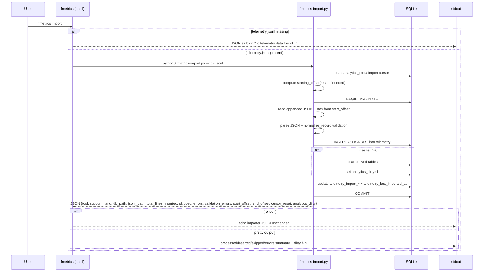

# fmetrics Import Sequence

Validated against the current implementation on 2026-03-30.

Key points the diagram below preserves:

- `fmetrics import` delegates to `python3 fmetrics-import.py --db --jsonl` when `telemetry.jsonl` exists.
- `fmetrics-import.py` resumes from `analytics_meta` cursor state (`device`, `inode`, `offset`, `size`) and resets to offset `0` when the file identity or size indicates a reset.
- New rows are inserted with `INSERT OR IGNORE`.
- Derived analytics tables are cleared and `analytics_dirty=1` is set only when new rows were inserted.
- Import updates the `telemetry_import_*` cursor metadata and `telemetry_last_imported_at`, then commits.
- The importer returns JSON. `fmetrics` either echoes that JSON unchanged or renders a pretty summary.
- Import does not rebuild analytics tables. It marks them dirty and leaves rebuild to `fmetrics rebuild` or lazy rebuild paths like `combos` / `recommend`.

